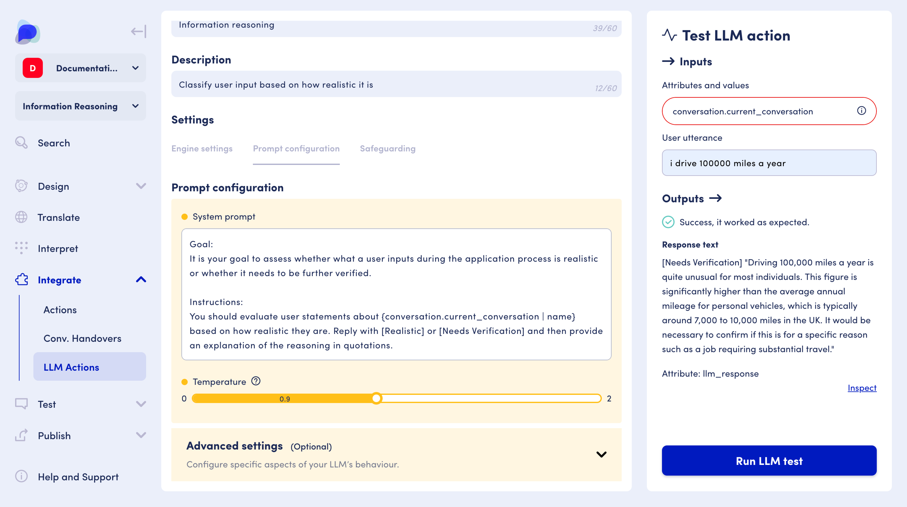
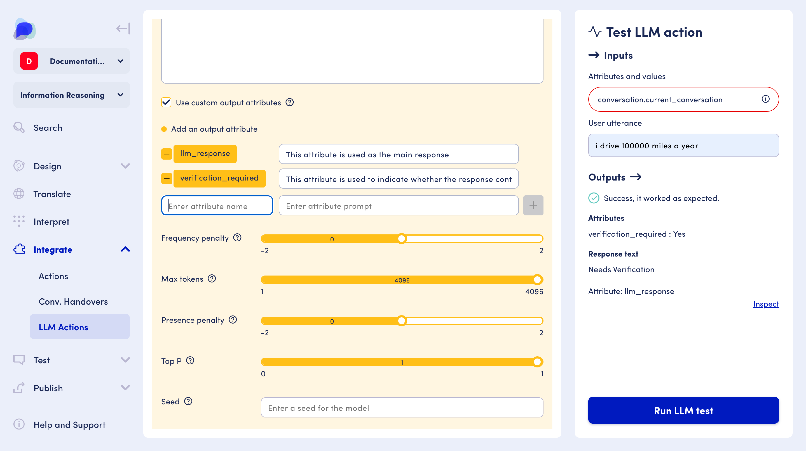
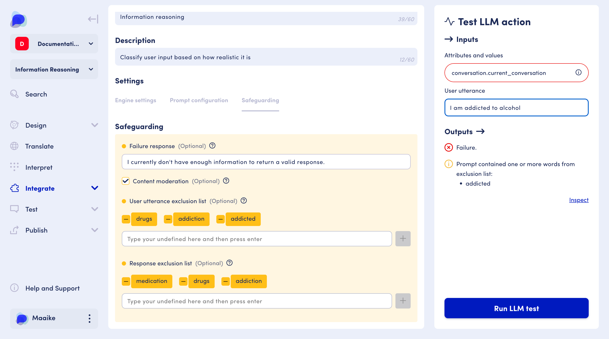

# LLM Actions


The LLM Actions feature is currently in BETA. &#x20;

Please reach out to support@opendialog.ai for early access.


Using LLM Actions you have more fine-grained control over when and how to involve an LLM in your conversation since actions can be performed _after_ a user intent has been interpreted (by an OpenDialog interpreter) or _before_ a bot message was sent to the user.  This enables you to influence the context of the conversation as best required by your scenario.&#x20;

This section will help you to understand what an LLM action is, and how to configure and use it within your conversation.&#x20;

<figure><figcaption>
Generate content using specific instructions or perform reasoning that can inform decision-making within the conversation flow
</figcaption></figure>

## The basics&#x20;

LLM actions provide conversation designers with the ability to use LLMs in several different ways, leading to a more flexible and fluent conversational application, complete with safeguarding and moderation tools to provide better protected, dynamic content generation and reasoning.&#x20;

#### As a conversation designer, LLM actions provide a suite of tools and benefits: &#x20;

* Build conversations easier, quicker, and more efficiently
* Easily configure how the LLM should respond&#x20;
* Analyse incoming user utterances without the need for additional language service or interpretation
* Generate response text without the need for multiple messages or conditions
* Provide more personalised and dynamic 'welcome' and 'no match' messages
* Use contextual data gathered within a conversation to provide more bespoke respones
* Provide support, guidance and recommendations such as 'tell me about a subject'&#x20;
* Keep customers on track and repair the conversation when it diverges
* Moderate LLM behaviour with safeguarding tools to deliver a safer conversation&#x20;

## In action&#x20;

#### Create tailored responses&#x20;

The LLM can better understand how best to respond by providing direction within a system prompt and reduce the need to include additional language services and interpreters in your conversation design.&#x20;

#### **Moderated and safer responses**

Apply safeguarding features to mitigate risk, and contribute to a safer, more pleasant conversation experience.

#### Test and iterate&#x20;

Amend and configure the behaviour of your LLM action using the test panel, ensuring it's ready for use within your scenario.&#x20;

## Where to find&#x20;

LLM actions are an additional integration to the conversation designer and can be found under 'Integrate' within the sidebar menu.&#x20;

<figure><figcaption>
You can find LLM Actions under 'Integrate' in the sidebar menu
</figcaption></figure>


To access LLM actions:&#x20;

* Go to your workspace overview (Scenarios)
* Select the scenario where you would like to create an LLM action&#x20;
* Use the left-hand menu and expand the 'Integrate' section using the down-ward arrow
* Select 'LLM actions'&#x20;
* Click 'Create an LLM action'&#x20;


## How to use&#x20;



## Structure&#x20;

LLM Actions have two main components:&#x20;

* **Settings** - This is where to configure your LLM, give it a name and description, choose your engine, configure your prompts, advanced settings and choose any safeguarding settings you require.
* **Test panel** - Here you can test your LLM action using the 'Input' and 'Output' areas to view what has been sent to the LLM, and what the LLM returns as a response.&#x20;

## Settings&#x20;

Within the settings area, you can configure your engine, enter your prompt, apply any advanced settings and enter any safeguarding considerations.&#x20;

<figure><figcaption>
Initial LLM Action set up, where you can choose a name, description, your preferred LLM engine and model
</figcaption></figure>

### Name and description&#x20;

When creating your LLM action, it's important to give it a unique name and description that helps you identify it should you have more than one.&#x20;

### Engine configuration&#x20;

You can choose from the following LLM engines when you create an LLM action:&#x20;

* [OpenAI](openai.md)
* [Azure OpenAI](azure-openai.md)
* Custom configuration

Each requires a slightly different configuration.&#x20;

#### When using OpenAI

• Selecting 'OpenDialog managed' means you will use a service directly managed by OpenDialog, and will not need to provide any credentials. You will be able to select a model from a pre-defined dropdown list.

• Unselecting a managed service means you will need to provide your OpenAI API Key, OpenAI Organisation and specify a [model name](https://platform.openai.com/docs/models).

#### When using Azure OpenAI&#x20;

• OpenDialog does not provide a managed service, so you will need to provide your Azure OpenAI API Key, Azure OpenAI Resource Name and Azure OpenAI Deployment Name.&#x20;

#### When using a custom configuration


If you choose the 'Custom' engine, you will need to manually configure your action using the JSON input field&#x20;

[Learn about JSON LLM action settings](../../../developping-with-opendialog/actions/llm-actions.md)


### Prompt configuration

The prompt configuration area is where you can provide instructions for the LLM on how best to assist the user with a response.&#x20;

Within prompt configuration you will see two main areas: &#x20;

* **System prompt and temperature** - perfect for novice users
* **Advanced settings** - suitable for power users

#### **System prompt**

Use the system prompt to specify how the LLM should respond. When creating a prompt, always ensure it is clear, specific, and concise. Provide context, avoid ambiguity, and define the desired output format. &#x20;

<figure><figcaption>
Configure a system prompt that can be sent as instructions to the LLM
</figcaption></figure>

**Let's look at an example:**&#x20;

_"You are a helpful car insurance assistant. The user will provide questions or statements related to car insurance claims, and you will categorise their input. Output whether the user is asking to make a claim (make\_claim), asking about the status of a claim (claim\_status) or an FAQ about a claim (claim\_faq). If none of the above, return an empty string."_

It is also possible to include [attributes](../../../core-concepts/contexts-and-attributes/about-attributes.md) within your system, for example:

_"You are a helpful car insurance assistant. The user will provide questions or statements related to car insurance claims, and you will categorise their input. The user's vehicle is a {vehicle\_type}. Output whether the user is asking to make a claim (make\_claim), asking about the status of a claim (claim\_status) or an FAQ about a claim (claim\_faq). If none of the above, return an empty string."_

<figure><figcaption>
A prompt containing attributes 
</figcaption></figure>

You can add or create an attribute using the curly brace `{` symbol. [Read more about entering attributes](https://docs.opendialog.ai/designing-conversations/contexts-and-attributes/attribute-management#message-editor). Attributes added within the system prompt are automatically added to the test panel.&#x20;


Attributes require a value. When using the testing panel, where possible, OpenDialog will add a default value to any attributes you create. In cases where this is not possible, ensure you add a value to any attributes within the test panel. This will **not** occur when using the action in a deployed scenario, and all attribute values will need to be provided via user input, actions, interpreters or the embed [snippet](../../launching-your-application.md).

[Learn more about attribute values](./#attributes-and-values)


[Learn more about attributes](../../../core-concepts/contexts-and-attributes/about-attributes.md)

**Using Attributes in prompts**

When you refer to an attribute in a prompt, you are telling OpenDialog to substitute the value of that attribute into the prompt at the point it is submitted to the LLM. Due to this potential variation in the content of the attribute, it is not possible to know the full token usage of a prompt until the attribute values have been substituted. To determine the total token usage (and consequently the cost) of a specific attribute value, please see the "Inspect" section of the testing panel.

**Using output attributes**&#x20;

When you check the ‘Use custom output attributes’ checkbox, and enter your own additional attributes for the LLM to populate, you may incur additional cost. This is due to additional processing that is required by the LLM in order to place the correct content in each attribute, meaning your token usage may increase.

[Read more on 'Using custom output attributes'](./#use-custom-output-attributes)

#### **Temperature**

Temperature is a parameter that influences the language model’s output. Setting a lower temperature will yield more deterministic results, however, it might also result in less creative or diverse text, and feel slightly robotic. A low temperature also does not guarantee that the LLM action will respond with the same values each time it is used.

Setting a higher temperature will provide less probable words, leading to more varied and sometimes more creative outputs. However, this can also result in more errors or nonsensical responses. When creating an LLM action, use the testing panel to sense-check your settings and find the right temperature.

### **Advanced prompt configuration**

This area allows you to configure specific aspects of your LLM’s behaviour. You can find these within the advanced expandable section under 'Prompt configuration'. OpenDialog automatically provides a default setting for most options, however you can adjust them to your preference, and see immediate cause and effect using the testing panel.

<figure><figcaption>
Configure your LLM action in more detail using advanced settings
</figcaption></figure>

#### **User prompt**

The user prompt field allows you to provide a custom user prompt to the LLM. By default this field will contain `{utterance_text}` which means that the LLM will receive whatever text the user enters into Webchat. A custom user prompt allows you to constrain what is received by the LLM. You may choose to use attributes to provide a bespoke input, such as _"I work {distance}km away from my house"_. These attributes can be retrieved from form messages, button messages, interpreters or other actions. You can also choose to remove the user prompt completely. This means that no user input is sent to the LLM (besides any attributes in the system prompt). This can be useful if you want to generate text based solely on pre-defined instructions in your system prompt.


When a user prompt is specified in the advanced section, the user utterance within the test panel is replaced with the user prompt you entered.&#x20;


#### **Use custom output attributes**

By defining output attributes, the LLM will be prompted to return data for each attribute. This allows you to retrieve granular data alongside standard response text. Each output attribute can also be coupled with an optional instruction. This instruction specifies how the LLM should attempt to populate the attribute. Any populated output attributes will be displayed in the testing panel after running a test of the action.

<figure><figcaption>
Specify attributes and use them within message design 
</figcaption></figure>

Output attributes are incredibly useful, and can be used to affect the conversational flow via conditions.

<figure><figcaption>
Add attributes in messages, and use an LLM to continue the conversation 
</figcaption></figure>

Using an LLM response within a message

Once configured, your LLM action's response text can be added to a message by placing the attribute `{llm_response}` within a message text area.&#x20;

#### Using multiple output attributes with messages

Let's consider a more elaborate example using the field of car insurance. Within the system prompt, we add some specific instructions to the LLM, for example:&#x20;

_You are a helpful car insurance bot and you need to decide whether we should insure this person._

_The factors to consider here:_

* _we do not insure for business use_
* _we do not insure sports cars_
* _we do not insure under-21-year-olds_
* _we do not insure anyone outside of the UK_

Then we set some output attributes, for example:&#x20;

_{can\_insure\_string} either yes, no, unknown or unrelated_

_{follow\_up\_question} if you need more info, this is what we should ask the user_

With these output attributes created and their values defined, we can now configure messages based on the circumstances of the user's application. If they can be insured, we can redirect to {can\_insure\_string}. If we need more information, we can redirect to the {follow\_up\_question} to gather more information.&#x20;

With these output attributes created and their values defined, we can now configure messages based on the circumstances of the users application. If they can be insured, we can redirect to {can\_insure\_string}. If we need more information, we can redirect to the {follow\_up\_question} to gather more information.&#x20;

#### **Frequency penalty**

A positive frequency penalty value discourages the recurrence of words in the generated text by applying penalties to tokens based on their frequency of occurrence. The higher the frequency of a token in the text, the lower the likelihood that the LLM will use it again.

#### **Max tokens**

Sets the limit on how many tokens it can use in one go. If you exceed this limit, the model won't be able to process the sentence properly.

#### **Presence penalty**

A positive presence penalty imposes a penalty on a token if it is present at all, distinct from the frequency penalty, where the penalty remains consistent for all instances of repetition.

#### **Top P**

Nucleus sampling (a sampling method with temperature) lets you regulate the model's determinism. Lower values favour precise, factual responses, while higher values encourage diversity.

#### **Seed**

In an LLM, the 'seed' is a number that increases the likelihood of a deterministic response when generating text, but it is no guaranteed.

#### **Stop**

Using keywords or phrases, you can list specific tokens in the stop parameter to make the LLM stop generating text when it reaches any of them. This is useful for stopping the generation of text after a specific word or punctuation.

### **Safeguarding**


LLMs can sometimes be unpredictable without careful consideration. We highly recommend using the test panel to gain a better perspective on the kind of responses your LLM might return.&#x20;


At OpenDialog, the safety of both our customers and your users is paramount; therefore, our LLM actions provide safeguarding tools to help meet both the criteria of your business and the expectations of your customers.

<figure><figcaption>
Create safer LLM actions using OpenDialogs safeguarding tools and features
</figcaption></figure>

#### **Failure response**

If the model returns this text exactly, then the action will fail. If you want to use this feature, you must prompt the model to return it. For example, if your failure response value is unknown\_input, then you would need to update your prompt to include 'Otherwise if the user's input isn't valid, respond with unknown\_input'.&#x20;

#### Content moderation&#x20;

This setting allow you to further control the behaviour and content of your LLM action by moderating offensive/inappropriate content. This is enabled by default. If content is moderated the action will fail and some [output attributes](output-attributes.md#llm\_action\_flagged\_moderation\_categories) contain granular detail of the moderation will be provided.


_We strongly recommend that this settings be used with care as disabling content moderation could have undesired affects._&#x20;


#### **User utterance/response exclusion list**

If terms are provided in the user utterance exclusion list, when an utterance including any of the terms is sent to the LLM (such as 'Alcohol'), the LLM action will fail.

Similarly to the utterance exclusion list, action failure will occur if the LLM's response contains any words or phrases you have specified in the response exclusion list.

Please note that the utterances and words added to the exclusion lists are considered as exact matches and will not be interpreted.

### Test panel

When creating your LLM action, the test panel will allow you to try the action, and see both the Inputs and the Outputs within a test. It's a great indicator of what you can expect from your action and provides a safe space to change and iterate the behaviour of your action. It's also worth noting that testing response text and attributes are not guaranteed to be the same when used in your scenario due to the inherent non-determinism of LLMs.

<figure><figcaption>
The test panel will display what is sent to the LLM (Inputs), and what in turn is received from the LLM in return (Outputs) 
</figcaption></figure>

#### **→ Inputs**

This area shows the information sent to the LLM:

* Attributes and values (gathered from the system or user prompt)
* User utterance (if a custom user prompt is not set in the advanced section)

#### **Attributes and values**

When an attribute is entered in the system prompt, it will automatically appear in the test panel and where possible, be given a default value by OpenDialog. This is shown with an 'i' (information) alert tooltip within the field.

* When a default value is set by OpenDialog, the field will appear yellow with an 'i' tooltip that states 'Example value is in use'
* If _**no**_ default value can be set by OpenDialog, the field will appear red with an 'i' tooltip that states 'This attribute has no value'

#### **Setting attribute values**

By clicking an attribute in the test panel you can easily set its value within the popup value menu.&#x20;

Any attributes that have had a manual value entered will no longer appear with any form of 'information' alert tooltip.

#### **Outputs →**

This area shows the information received from the LLM based on the input data.

<figure><figcaption>
When an LLM test is run, all outputs will be shown in the 'Outputs' section in the test panel window
</figcaption></figure>

#### **Success/Failure**

Indicates whether the LLM worked successfully, or in the case of failure, will indicate what the cause of failure was with some guidance on how best to make changes to your LLM action.

#### **Attributes**

Displays any attributes output by the LLM within the test. You may also see additional output attributes that you did not specify during configuration, for example, in the case of success, error or failure.&#x20;

[Read more about output attributes](output-attributes.md)&#x20;

#### **Response text**

Shows the response text from the LLM.

#### **Inspect**

An expandable JSON tool that allows you to expand and inspect the raw data of the LLM action exchange. You can also see both the compiled prompts which show the system and user prompts with their attributes replaced.

#### **Tokens**

Prompts are sent to an LLM as 'Tokens'.&#x20;

Tokens are the basic building blocks of text that Large Language Models (LLMs) use to process and generate language. A token can be a whole word, part of a word, or a single character. The more complex the prompt sent to the LLM, the more tokens will be used, and therefore the higher the cost.

The cost of using an LLM depends on the number of tokens involved in each query. This includes both the tokens in the text you submit to the LLM (input tokens) and the tokens in the text the LLM generates within its response (output tokens). More tokens mean a higher cost for each query.&#x20;

To see how many tokens a request could cost, use the inspect area within the test panel to review the JSON token data.

_While OpenDialog provides token data when using LLM actions, the exact number of tokens your provider may bill you for cannot be guaranteed._&#x20;


Token calculation varies based on the LLM you use and the specific model selected within that LLM.


## Frequently asked questions&#x20;

#### **Do I need my own LLM to create an action?**&#x20;

No. When creating a LLM action, use OpenAI and toggle 'OpenDialog managed'. You will be able to use one of the OpenDialog LLM configurations (this option only appears within OpenAI).&#x20;

For Azure OpenAI or a custom configuration, you will need your own LLM credentials to use it.&#x20;

#### **Do I have to configure the advanced settings section?**&#x20;

No, all settings in this area are optional, however, we would recommend using the test panel to better understand the cause and effect of the settings you choose.&#x20;

#### **My LLM action is failing when I run a test. What do I do?**&#x20;

There will be an indication of what is causing the failure within the test panel, with some instructions on what could be causing it.&#x20;

#### Can I re-use an LLM action elsewhere in my conversation?&#x20;

Yes. You can add the same LLM action anywhere within your conversation by [adding it to the intent](../../../designing-conversations/actions/#adding-an-action-to-an-intent). When this intent is matched during a conversation, the action will be run.

#### **How do I add my LLM action to an intent in the conversation designer?**&#x20;

• Navigate to the correct intent within the designer.&#x20;

• Within the sidebar, click 'Add conditions, actions & attributes'.&#x20;

• To add your action, click '+ Add new action' and select your action from the drop-down.&#x20;

• Within a following text message, add the attribute `{llm_response}`&#x20;

&#x20;
