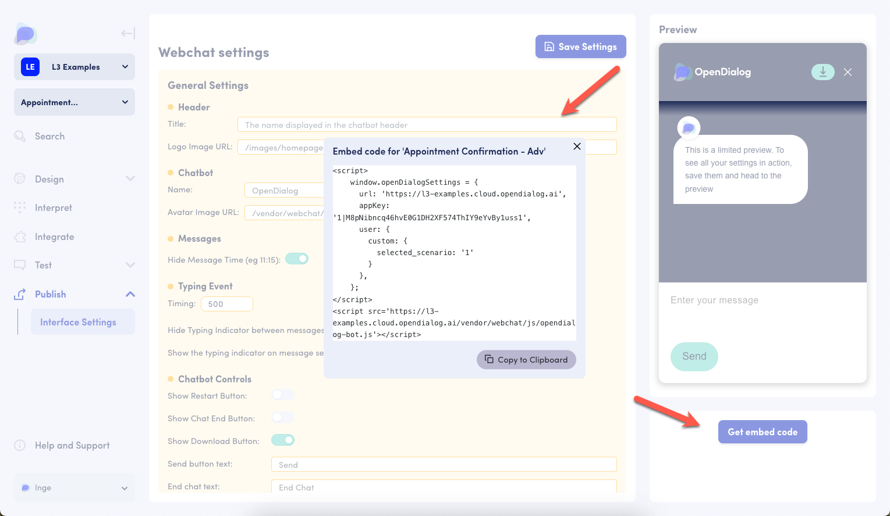

# Launching your application

## Publishing a single scenario to WebChat

To launch your conversational application using the OpenDialog WebChat on your website or application, start by activating the scenario. To do so, go to the 'Scenarios' page and click on the slider to set it to 'active'.

.png>)

Next, go to Interface Settings under the Publish menu and click "Get embed code". Copy the embed code. &#x20;

<figure><figcaption><p>Interface settings screen with open embed code window</p></figcaption></figure>

Add the embed code to the bottom of the `body` section on the website or application page(s) where the WebChat should appear. &#x20;

## Alternating scenarios in a single WebChat embed using aliases

### The basics

OpenDialog Aliases allow you to create a single point of reference for your WebChat application.  This functionality will enable you to define an 'alias' and map the scenario of your choice at any given time.&#x20;

### Aliases in action

* **Add WebChat once, and publish any scenario**.  The alias functionality allows you to have a single WebChat embed code to which you can deploy different scenarios at the moment of your choice without changing the underlying structure or code.
* **Update your live application on the go**, by switching scenarios easily. You can now update your live application by mapping an alias to a different scenario with just one click.
* **Use different scenarios at different moments for A/B testing, without structural changes.**  Using an alias and mapping different scenarios to the alias, allows you to A/B test one scenario over another through your live application.

### Where to find

An alias can map to any given scenario and therefore exists on the Workspace level.  You can access the Aliases functionality from the Workspace Dashboard by expanding the 'Scenarios' drop down menu, where you can then find 'Aliases' in the Menu.

<figure><figcaption><p>Access the Alias functionality via the Workspace Menu</p></figcaption></figure>

### How it works


How to use Aliases in the OpenDialog Product


#### Creating an alias

To create an Alias you need an Alias name and a scenario.&#x20;

The Alias name must follow certain rules: only lowercase letters can be used, and spaces must be replaced with underscores (\_). No numbers, symbols, or uppercase letters are allowed.

<figure><figcaption><p>The Alias creation UI</p></figcaption></figure>

An alias is mapped to an existing scenario.

Once the Alias is created, an embedded WebChat code is created and provided.

#### Updating an alias

Once an Alias is created it appears in the Alias tab of the workspace. To edit, click into the Alias, change the linked scenario, and click the "Update Alias" button.

<figure><figcaption><p>The Alias updating UI</p></figcaption></figure>

The only part of an Alias that can be changed is the scenario it links to. The name cannot be changed, and the embedded webchat code will not be changed when the scenario is changed.

## Session expiry in WebChat

**Session Expiry** is the time after which the session will expire after there is no activity with the WebChat application. This is a security feature that is used to prevent unauthorized access to the system. The session expiry time can be set by the system administrator and/or scenario designer and can be changed as per the requirement.

### How it works

After user inactivity larger than the WebChat application session expiry time, the session will expire. Any interaction with the chatbot after that will continue the conversation to an intent called **intent.core.sessionExpired**. This intent can be used to handle the session expiry event and conversation can be continued from there, as the designer see fit.

The default WebChat scenario has a default implementation of the **intent.core.sessionExpired** intent, which will end the conversation with a message to the user that the session has expired. The session expiry message has an option to restart conversation by default. Designer can change this behavior as per the requirement.

On older scenarios, where the **intent.core.sessionExpired** intent is not present, and you set the expiry time, the conversation will fall back to **No Match** Intent. So, if you set the session expiry time, it is recommended to add the **intent.core.sessionExpired** intent to your scenario to handle the session expiry event.

If the session expiry time is not set, or it's value is set to **0** the session will not expire and the conversation will continue as normal.

The session expiry is handled in an escalating way meaning that it can be caught at various levels of the scenario in the same way as **No Match** and **Restart** intents are. The supported intents are:

* **intent.core.TurnSessionExpired**
* **intent.core.SceneSessionExpired**
* **intent.core.ConversationSessionExpired**

### How to set the session expiry time

The session expiry time is controlled by an attribute called **session\_lifetime**. Its value is in seconds, where **0** means no expiry. Absence of this attribute also means no expiry of the session.

This attribute is added in the embed code of the WebChat application. By default, this is set to **0**.

Here's an example of the embed code:

```javascript
<script>
  window.openDialogSettings = {
    url: 'https://brian-may.cloud.opendialog.ai',
    user: {
      custom: {
        selected_scenario: '0x420',
        session_lifetime: 0
      }
    },
    parentEl: "#chatbot"
  };
</script>
```
