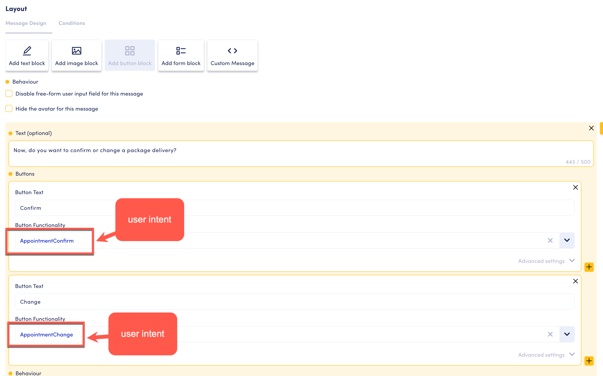

# Troubleshooting and Common Problems

Q: I get a "check your behavior" error in the player

<figure><figcaption></figcaption></figure>

A: Check that you don't have two of the same type of intents following one another, e.g. an app intent followed by an app intent.&#x20;

Check that your components have the correct behavior, e.g. starting and open behaviors.&#x20;

Q: I created my intent in the conversation designer but I can't find it when I'm in a button block.&#x20;

<figure><figcaption></figcaption></figure>

A: Check that you defined the intent as a user intent. App intents won't show up since the button requires a user intent.&#x20;

Q: Do I need virtual intents to move from a button block to the next prompt (app intent)?&#x20;

A: A button block allows you to add a message to your app intent and indicate buttons and labels. For each button, you need to indicate the USER intent that the button goes to. In other words, for each button we need a user intent to capture that the user clicked that button. From that user intent you then move to the next app intent, so no virtual intent is needed.&#x20;

E.g.&#x20;

A: Do you want to confirm or change your appointment? \[buttons in the app intent for "confirm" and "change"]

U: Confirm \[user clicks confirm. The system moves to the user intent that is indicated for that button in the app intent]

A: Ok, great.... \[from the user intent, the system moves to the next app intent through the typical mechanisms (e.g. intent in same turn, transition, ...).&#x20;

<figure><figcaption>
Details of the button block and selection of user intent for each button
</figcaption></figure>

