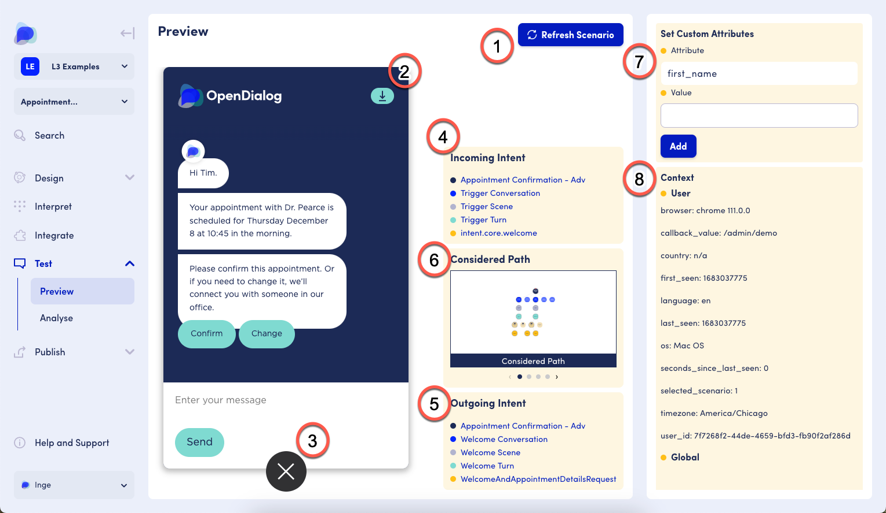
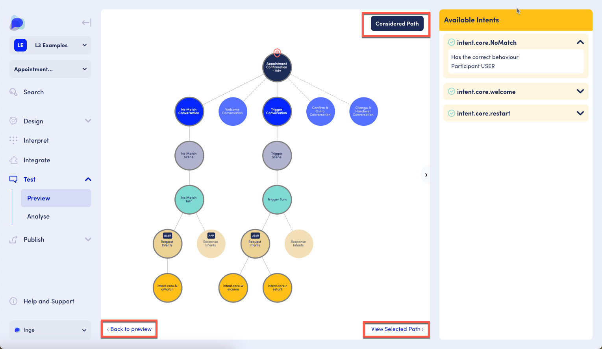
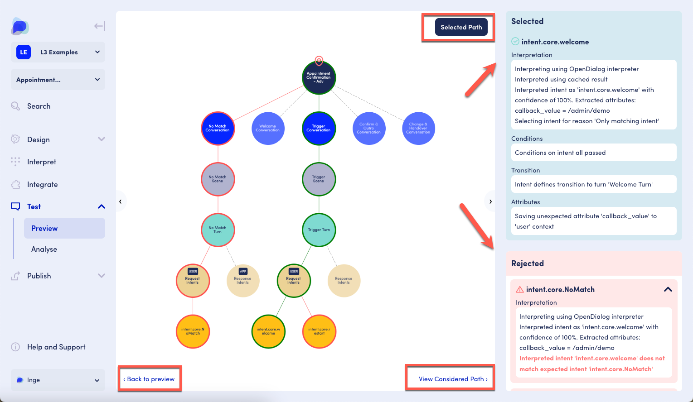
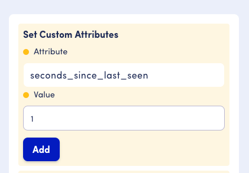

# Previewing your application

Within OpenDialog you can preview any Webchat application so you can test and validate the conversational experience before deploying your application.&#x20;

<figure><figcaption>
Default conversation design view
</figcaption></figure>

In the Test functionality, click on Preview to interact with the preview application. If Preview is not visible, click the carrot (down arrow) next to Test.&#x20;

### Functionality

The chatbot preview options include:

* 1 - Refresh Scenario: this refreshes the scenario, including resetting context and removing custom attributes
* 2 - Download chat transcript
* 3 - Minimize preview&#x20;

The links are clickable and will take you through to the intent so that you can make any changes as required.

<figure><figcaption>
Preview screen
</figcaption></figure>

Diagnostic tools include:

* 4 - The path of the incoming intent. Links are clickable
* 5 - The path of the outgoing intent. Links are clickable
* 6 - The paths that were considered by the conversation engine
* When clicking in the Considered Path, a larger version of the considered path is displayed, and an option to view the selected path (circles with green border), the non-selected paths (circles with red border) and an explanation for both selected and rejected paths

<figure><figcaption>
Considered Path
</figcaption></figure>

<figure><figcaption>
Selected Path
</figcaption></figure>

Simulating custom attributes is possible in 7 - Set Custom Attribute. This is helpful to try out conditions on messages, components or intents.&#x20;

As an example, imagine we want to show different messages to users depending on whether they are a new user or a returning user.&#x20;

In the message editor, we need to set conditions on the messages to indicate which message should show depending on the value of the attribute saved against the user. To distinguish a new user of the bot from a returning user, we set the 'Attribute' to `seconds_since_last_seen` and the 'Value' to be less than '`0`' for new users or to be greater than '`0`' for returning users.

To test this within the preview, for a returning user, we would type in `seconds_since_last_seen` to the 'Attribute' field and then '`1`' into the value field then click on 'Add'. The updated value is shown in the User section of the Context. &#x20;

Note: in general no further action needs to be taken to set the custom attribute. Specifically for `seconds_since_last_seen` we need to refresh the whole page. Do not click Refresh Scenario as this resets the entire context, including the value we just defined. &#x20;
