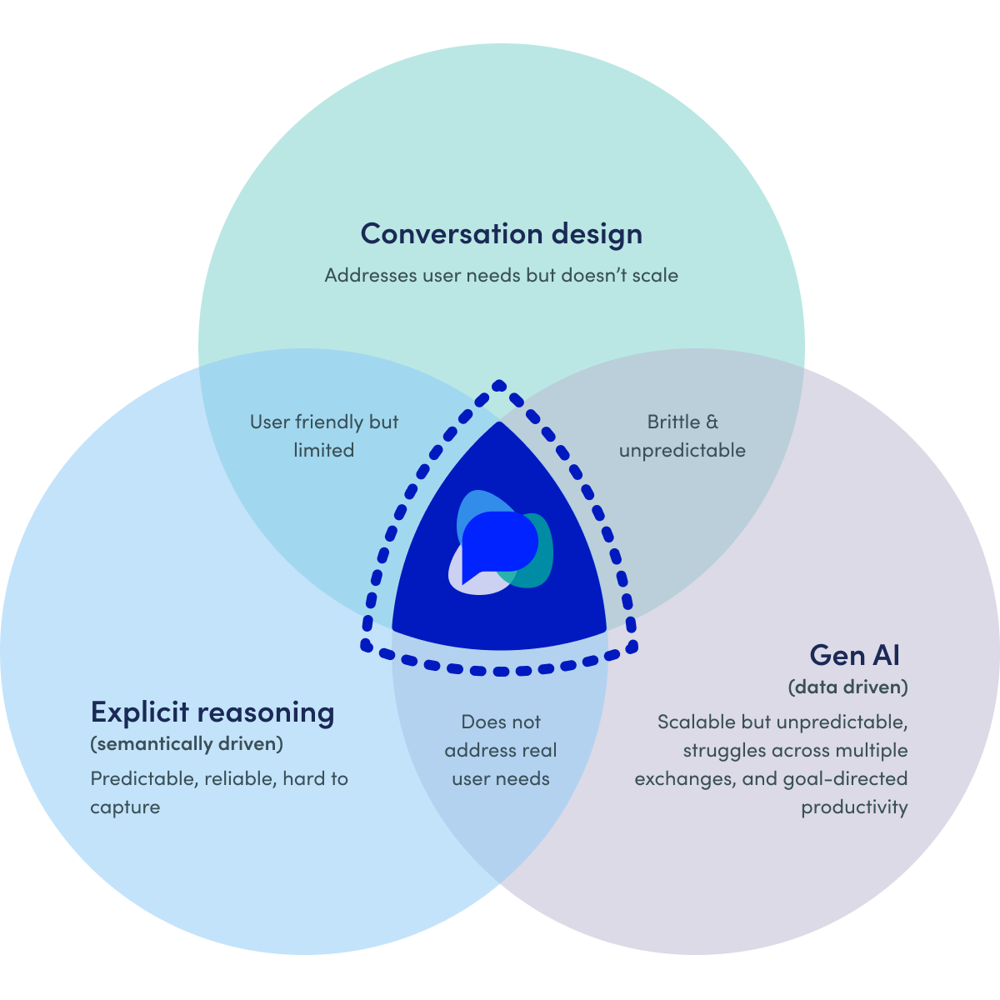

# OpenDialog Approach

> Get the most out of OpenDialog by spending some time getting familiar with the OpenDialog approach to AI Agent conversational design.&#x20;

Our aim is to support a wide range of GenAI-powered conversation styles from simple question-answering to sophisticated multi-step processes with complex interactions and custom widgets.&#x20;

To achieve this three ingredients are necessary.&#x20;

* The **conversation or application designer** (that's you!) needs to be in complete control of the conversation and easily specify and support different interaction styles from open-ended chat to goal-driven structured exchanges mixing and matching LLM capability and dialog flows as the context of the conversation requires.&#x20;
* **Explicit rules** need to be supported and tightly integrated with conversation context and data so as to adhere to business and other process rules and regulations and drive better use of LLMs through retrieval-augment generation or other techniques.
* **LLMs need to be flexibly and safely brought into the process** to enable advanced natural language understanding and reasoning, providing a choice of prompt styles, LLM providers as well as solid analytics to track what is happening.&#x20;

In the best of Venn diagram traditions - we illustrate below that _sweet spot_ OpenDialog is after, where human-led design and machine driven rules and prediction (or generation) come together to provide a positive experience for the user.&#x20;

<figure><figcaption>
Combining conversation design with explicit reasoning and GenAI
</figcaption></figure>

To enable all of this we've re-thought from the ground-up what designing a conversational application actually means.&#x20;


[designing-conversational-ai-agents.md](../core-concepts/the-opendialog-model/designing-conversational-ai-agents.md)


