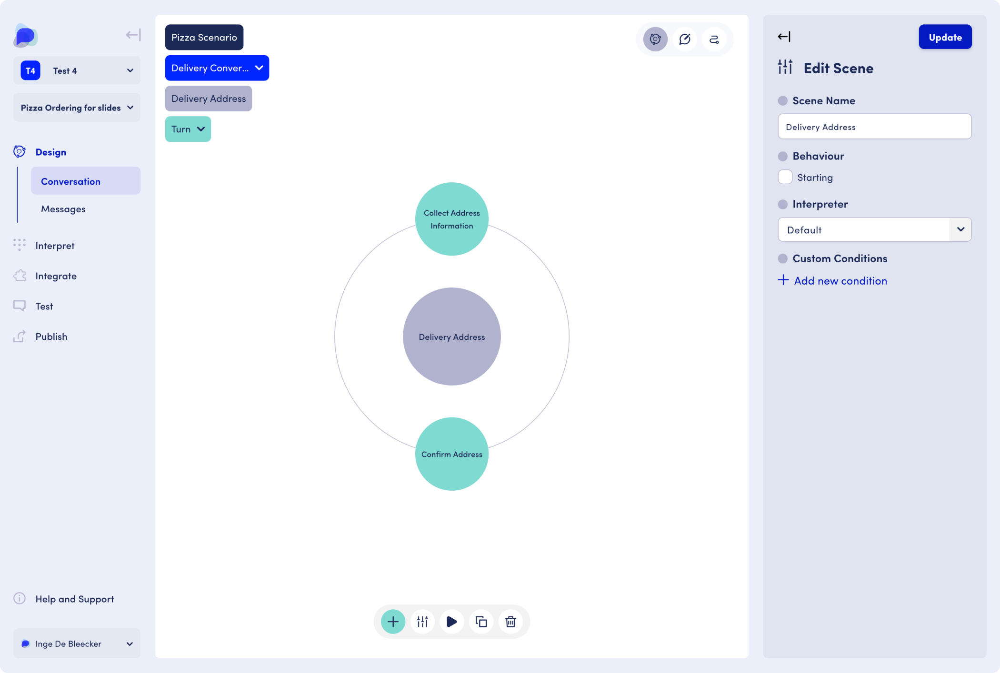
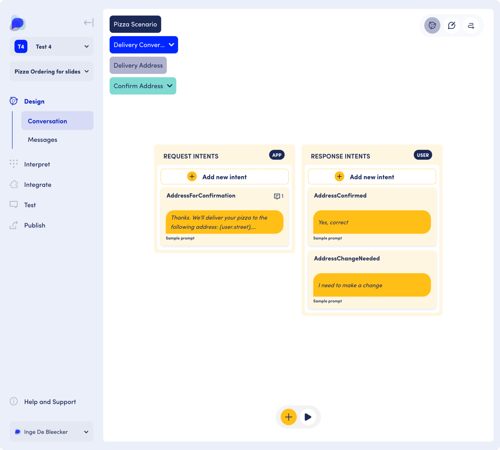

# OpenDialog Model

The OpenDialog model enables much of the flexibility that the platform provides. The model consists of levels and components that help you build out your conversations. It allows you to take a design-system approach to conversation design, going from high-level scenarios to individual turns within a conversation.

The different levels of the model are:&#x20;

<figure><figcaption>
Level of the OpenDialog model
</figcaption></figure>

## Scenario

A scenario is the highest level in the model. It encompasses the set of functionalities that make up a conversational application. Example: pizza scenario.

<figure><figcaption></figcaption></figure>

## Conversations

A conversation refers to communication for specific goals. Conversations can be viewed as steps in the customer journey, or conversations to be had. Examples: a welcome conversation, a payment and delivery conversation.&#x20;

<figure><figcaption></figcaption></figure>

## Scenes

A scene deals with a specific stage, aspect or subgoal of a conversation. It is a middle layer in the model that allows for much flexibility in building out conversations. Example: a payment conversation can include a scene to finalize payment. A delivery conversation can include a scene to collect delivery details such as the address.

<figure><figcaption></figcaption></figure>

## Turns

In a turn the user and application exchange specific information or intents. Example: the scene to collect a delivery address can have two turns: a turn to collect the address details and a turn to confirm the address details that were collected.

<figure><figcaption></figcaption></figure>

## Intents

A turn consists of intents. An intent holds the message and its meaning. An intent can come from the app or the user. Example: The confirm address turn can include an app intent that presents the address details for confirmation. A follow-on user intent can be to confirm that the information is correct.

<figure><figcaption></figcaption></figure>

## To summarize

<figure><figcaption>
Overview of the components in the OpenDialog model
</figcaption></figure>
