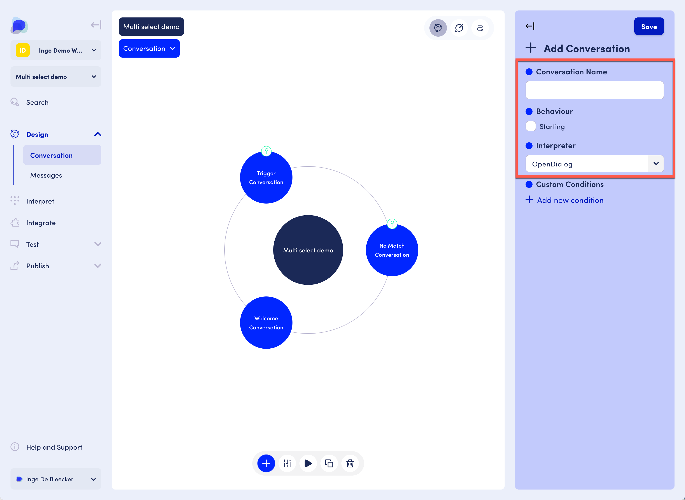
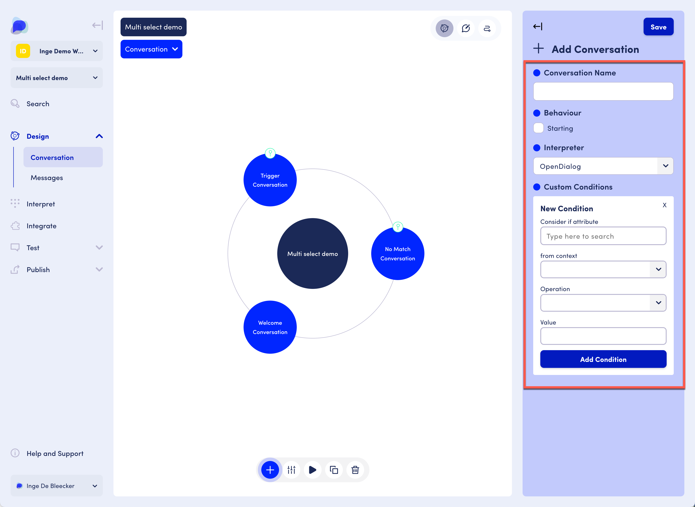

# Conversations

## Conversation settings

Settings include a conversation name, whether the conversation exhibits starting behavior, and selecting an interpreter to use.&#x20;

<figure><figcaption>
Conversation settings
</figcaption></figure>

Clicking "Add new condition" opens the New Condition area:

<figure><figcaption>
Conversation settings expanded
</figcaption></figure>

Conditions allow you to check values of attributes within contexts. The conversation will be considered if the conditions are met.&#x20;

Example: imagine you are building an ecommerce scenario and you have unregistered and registered users. Registered users may get welcomes with different options, e.g. maybe they are shown some deals that unregistered users won't see. It may well be helpful to set up a conversation where the condition is that the user is recognized as a registered user while there is another conversation for unregistered users.&#x20;
