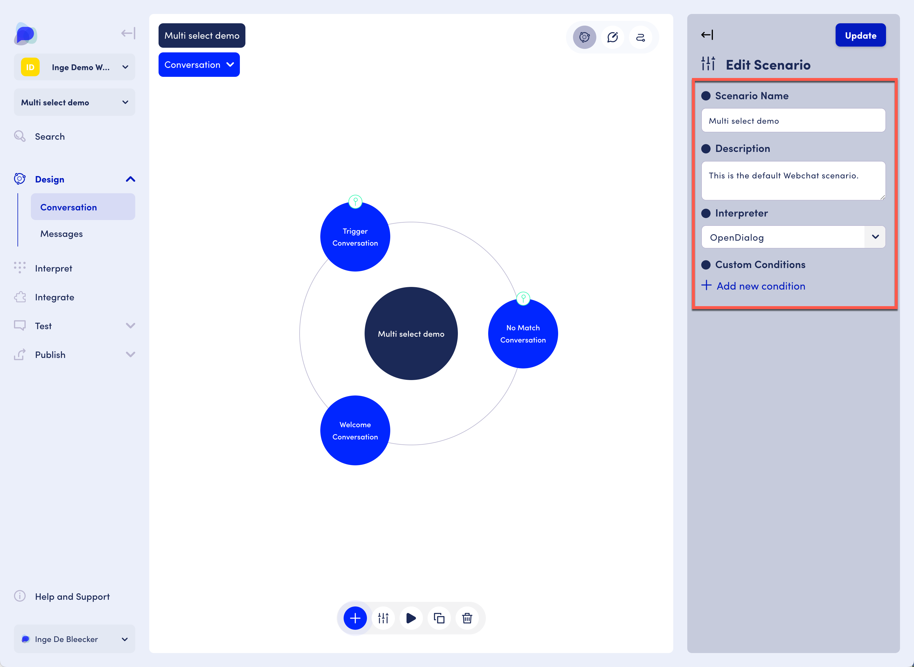

# Scenarios

## Active and draft scenarios&#x20;

Scenarios can be in either an "Active" or in "Draft" mode.&#x20;

Active scenarios are available to be used in chat interfaces, while draft scenarios are not considered.&#x20;

## Scenario settings

You can edit the Scenario name, description, set a preferred interpreter (which will act as the default interpreter throughout the scenario) and also set conditions. Setting a condition on a scenario is relevant in a multi-agent architecture, where conditions on scenarios identify a scenario for consideration.&#x20;

<figure><figcaption>
Scenario settings in the conversation designer
</figcaption></figure>

Other actions for a scenario, including deleting, duplicating and exporting are performed from the scenario list page in the workspace. See [The OpenDialog interface](../the-opendialog-workspace.md).&#x20;
