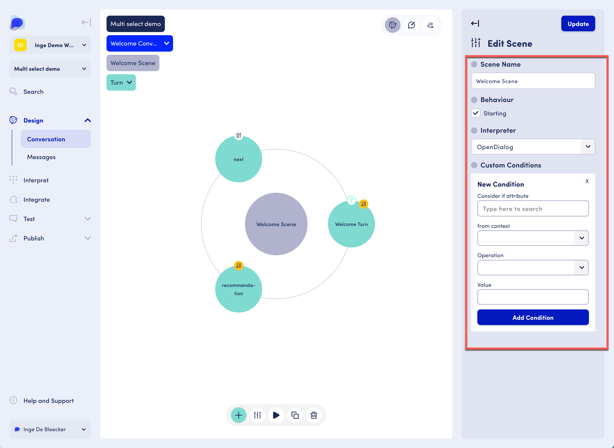

# Scenes

## Scenes settings

Settings include a scene name, whether the scene exhibits starting behavior, and interpreter selection.&#x20;

Clicking "Add new condition" opens the New Condition area.

<figure><figcaption>
Scenes settings
</figcaption></figure>

Conditions allow you to check values of attributes within contexts. The scene will be considered if the conditions are met.&#x20;

Example: imagine an assistant that contains a multi-step process, similar to a form. Imagine that in step 3 the user's age is asked. If the user is within a certain age bracket, some additional questions are required. If they are not, those can be skipped. In step 3, an attribute is set with the age information. In the next step, the condition checks that attribute value and decides to enter the scene or not. &#x20;
