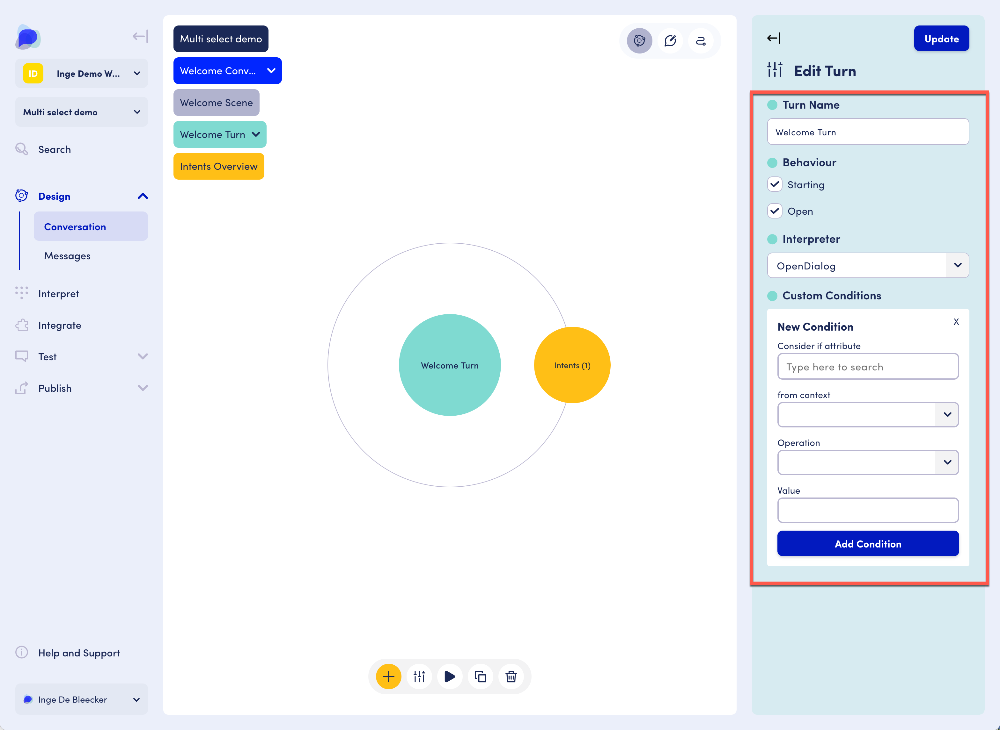
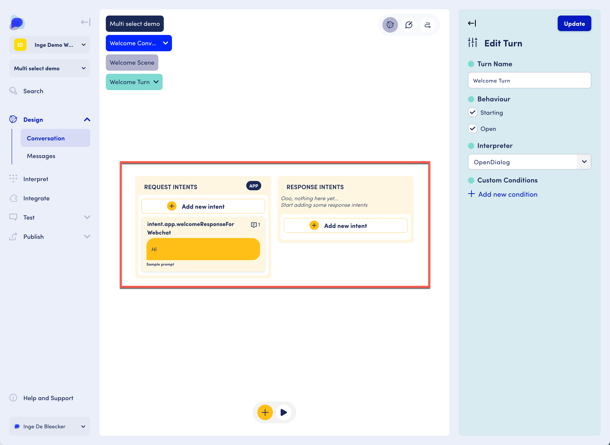
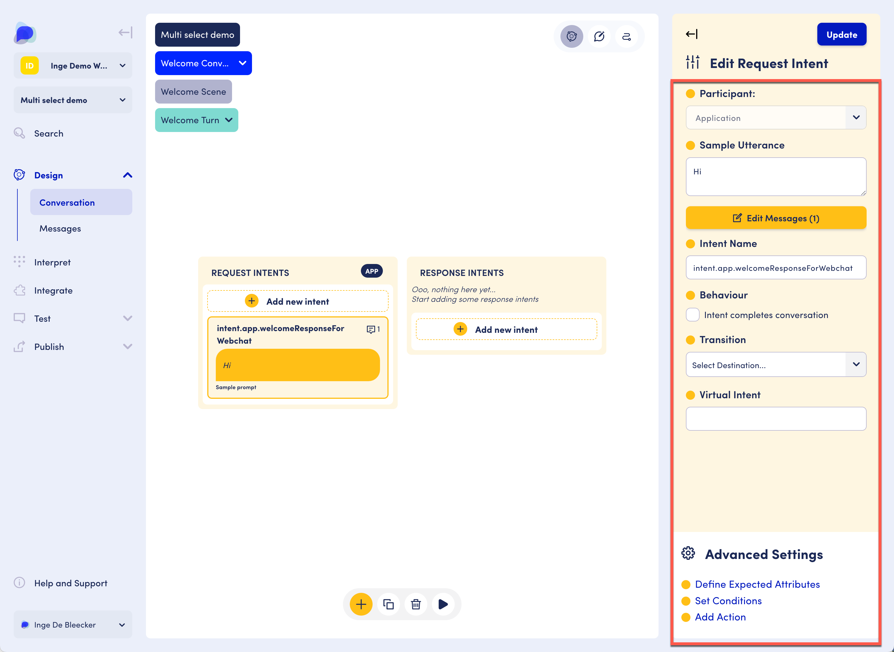

# Turns and intents

## Turns settings

Settings include a turn name, whether the turn exhibits starting and/or open behavior, and interpreter selection.&#x20;

Clicking "Add new condition" opens the New Condition area.

<figure><figcaption>
Turns settings
</figcaption></figure>

Conditions allow you to check values of attributes within contexts. The turn will be considered if the conditions are met.&#x20;

Example: imagine that a number of questions are asked in sequence. Imagine that in question/turn 3 the user's age is asked. If the user is within a certain age bracket, an additional question is required. If they are not, that question can be skipped. In turn 3, an attribute is set with the age information. In the next turn, the condition checks that attribute value and decides to enter the turn or not. &#x20;

## Intents in turns

Turns contain a set of Response and Request intents. You can decide which participant (the user or the application) should initiate a turn based on the overall flow of the interaction that must follow the app - user - app - ... or user - app - user... order.&#x20;

If the intent has a request intent followed by a response intent: when the request intent is evaluated, the engine will look if there is a response intent in the same turn, and execute that.&#x20;

<figure><figcaption>
Intents in turns
</figcaption></figure>

As shown above, it is acceptable to only have a single intent (whether app or user intent) in a turn. In this case, there is not accompanying intent in the same turn for the conversation engine to execute. Instead one of two situations happens:&#x20;

1. You define a transition for the intent in the turn. The engine will follow the transition and attempt to find an appropriate intent on the _end_ of that transition. An appropriate intent would be the _opposite_ participant. So if in Turn A the request intent is from the APP we will be looking for intents from the USER in Turn B and vice-versa. This allows you to do cadence switch on transitions to have natural conversation flows.&#x20;
2. You don't define a transition, in which case the engine will go back to the scene level and look for open turns that it could follow that have the _opposite_ participant. So if you had Turn A with an APP intent and no response intents that engine would look for other open turns with a USER request intent to enter. This again allows you to switch cadence, deal with out of context questions such as FAQ, etc or localized no matching.&#x20;

It is acceptable to have multiple intents in the list of request or response intents. The intents get executed in order (from top to bottom). This is important when intents have conditions as you want to make sure that the most generic condition is listed last (otherwise it would match and the more specific conditions would not be evaluated).&#x20;

## Intent settings

<figure><figcaption>
Intent settings
</figcaption></figure>

The Intent Name is the more formal name for the intent that we use to refer to it through interpreters (for incoming intents) or in the message repository (for outgoing intents). A good naming format to use for this is `intent.user.<name of intent>` for user intents and `intent.app.<name of intent>`for app intents. However, feel free to use whatever makes sense for your better understanding of the flow.&#x20;

### Interpreter and Confidence Level

The Interpreter indicates which interpreter we will be using for the intent in question, while the confidence level determines the minimum confidence level acceptable for the intent.&#x20;

### Intent Behaviours

Yes, Intents have behaviours as well! Intents currently just have the _COMPLETING_ behaviour, which means that if the intent is matched it will also mark the conversation as completed. A completed conversation will take us back at the top of the scenario and look for another way in through STARTING conversations, scenes, turns, etc.&#x20;

### Transitions

Intents can also cause transitions. What this means is that if the intent is matched it will cause a transition to another Conversation or Scene, and the Conversational State will pick up from there.

### **Advanced Settings**

Within each intent you can add the following advanced settings to an intent:

* **Conditions**: You can add conditions to intents to only show specific intent based on certain criteria. If a condition that has been added is met, then it will show the intent e.g. if we only want to show this intent to new users then we would set a condition such as `seconds_since_last_seen`with the operation set to `Less Than` and the value set to `0` - Meaning only user that have never interacted with the application will see this intent. _More information will soon be available on Conditions._
* **Actions**: We can also add actions that will have been define in the 'Action' section. As so, if this intent is selected, the named action will be run. _More information will soon be available on Actions._


Any action type (whether it's a Webhook, Action or LLM Action) can be added to an intent using this method.&#x20;


## Reserved Intent Names&#x20;

Some intents have special meanings in OpenDialog so it's worth highlighting those here:

### intent.core.welcome

This intent is mapped to an event from webchat - it is called whenever webchat loads for a new user and provides a way to kickstart the conversation. It is automatically set as a Request Intent of the Welcome Scene's Welcome Turn.&#x20;

### intent.core.restart

This intent is fired when users click on the "Restart" button in webchat. It is automatically set as a Request Intent of the Welcome Scene's Welcome Turn.&#x20;

### intent.core.endChat

This intent is fired when users click on the "End Chat" button in webchat.&#x20;

### intent.core.TurnNoMatch

If no interpreter is able to provide a positive interpretation of a user utterance the Conversation Engine will generate a TurnNoMatch intent and attempt to find a Turn within the scene that can handle it.&#x20;

### intent.core.SceneNoMatch

If no turn within the current scene handles the `intent.core.TurnNoMatch` the Conversation Engine will generate a Scene No Match and escalate a level above to try and find a match for that.&#x20;

### intent.core.ConversationNoMatch

If no scene within the current conversation handles the `intent.core.SceneNoMatch` the Conversation Engine will generate a Conversation No Match and escalate a level above to try and find a match for that.&#x20;

### intent.core.NoMatch

This intent is fired by the Conversation Engine whenever all interpreters return a no match and no lower-level No Matches (described above) were caught.&#x20;

Currently, this is automatically set as the Request Intent of the No Match Turn in the No Match Conversation.&#x20;
