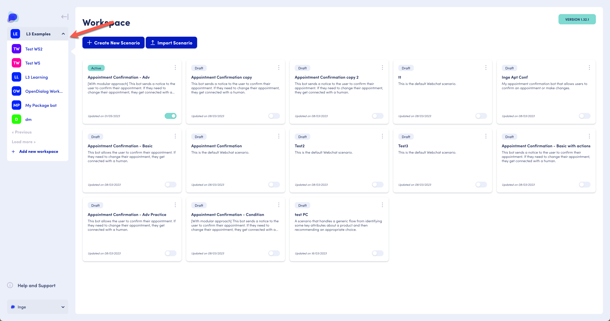

# The OpenDialog Workspace

## Workspace

The workspace is the starting point for finding and managing your scenarios. When you engage with OpenDialog, a workspace gets set up for you. This can be either on the [cloud.opendialog.ai](http://cloud.opendialog.ai) environment or your own custom environment, e.g., \<company\_name>.opendialog.ai

The Workspace Dashboard helps you create and manage scenarios. More features will be added soon so you can set up components to use across different applications.

<figure><figcaption>
The Workspace Dashboard is your go-to starting point to create &#x26; manage your applications.
</figcaption></figure>

The lefthand pane provides access to menu options and allows you to switch to another workspace or add a new workspace.

<figure><figcaption>
Switching to another workspace or adding a new workspace
</figcaption></figure>

## Scenario

Each workspace holds one or more scenarios. You can access the Scenario overview through the left-hand panel menu, by selecting 'Scenarios' and then 'Overview'. You can also do so by accessing the Scenario overview through the dedicated button 'Manage scenarios'.

<figure><figcaption>
Access the scenario overview through the left-hand menu or via the Manage Scenarios button.
</figcaption></figure>


**Note**: If your workspace has no scenarios yet, the Workspace Dashboard will indicate 0 scenarios, and the button will say 'Create scenario.'  Clicking the 'Create scenario' button will allow you to create your first scenario. More on [creating new scenarios](the-opendialog-workspace.md#creating-a-new-scenario) below.


Scenarios are by default, created in draft mode. To use in a live environment, set the scenario to active by toggling the switch in the bottom right corner of the scenario tile (example shown in top left corner of scenario list), and [publish](webchat/launching-your-application.md) it.&#x20;

#### Creating a new scenario

Create a new scenario using the main area's 'Create Scenario' button.

<figure><figcaption>
Create a new scenario via the 'Create new scenario'  button or import an existing scenario via a .json file
</figcaption></figure>

#### Duplicating, deleting and exporting a scenario

Click the vertical dots icon in the top right corner of a scenario tile to access the duplicate, delete and export functionality.&#x20;

When duplicating a scenario the duplicated scenario will be added to the workspace as the last one in the list. You may have to refresh your browser for it to display.&#x20;

Exporting a scenario results in an email being sent to your registered email address in OpenDialog. The scenario is contained in an attached .json file. That .json file can then e.g. be imported in another workspace.&#x20;

Duplicating and exporting may take a few minutes; you will be notified by email when the resulting file is ready.&#x20;

<figure><figcaption>
Example of Scenario functionality
</figcaption></figure>

#### Importing a scenario

To import a scenario, you will need access to a .json file that you will upload during import. E.g. you may have received a .json file as an export from another workspace, as an email attachment.&#x20;

<figure><figcaption>
Import scenario option at the top of the main Scenario Overview area.
</figcaption></figure>

Use the Import Scenario button at the top of the main area and provide the .json file. Note that there is a 10mb file size limit on scenario .json files.&#x20;

The next pages provides details of the Design and other platform functionality.&#x20;
