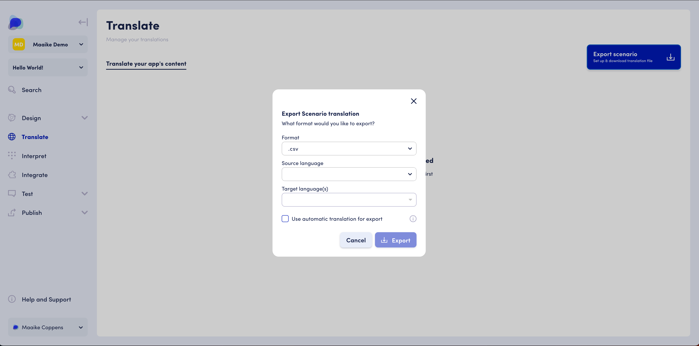

# Translating your application


OpenDialog Translate is currently in Alpha release. If translation is something you want to explore for your conversational application, don't hesitate to get in touch with your OpenDialog contact to enable Translate for you.


This section outlines how to translate your conversational application's content and how to update your conversational application accordingly.

<figure><figcaption>
OpenDialog Translate lets you auto-translate and share your content strings as a spreadsheet with your translators.
</figcaption></figure>

### **The basics**

Translate lets you translate your application's conversational content strings, which you can then use to allow your users to interact with your conversational application in the language of their choice.

It allows you to :

* Define a base language for your conversational application
* Translate user-facing content, including interface elements
* Understand, at a glance, the completeness of translations
* Check & test translations before launching thanks to OpenDialog Preview
* Present conversational content to end-users in the language of their choice

Translate provides you with a quick, scalable and industry-compliant way of exporting conversational content into different file formats for translation and then importing those translations for multilingual use in your conversational application.

### **Translate in action**

#### Align with translation workflows

Exporting your conversational content into a usable format for translators allows you to align with their workflow and prevents translators from learning a new tool to manage their work.

#### Auto-translate to accelerate time-to-market

By using the auto-translate functionality, you can give your translation team a head start and accelerate the translation process significantly.

#### Manage translation status

By viewing the number of missing strings for each language, you get a clear understanding of the progress and readiness to launch of each language that you want to support.

### **Where to find**

Translate allows you to manage your content for multilingual use in your conversational application. In addition, the Translate feature provides a Multilingual Dashboard to manage translation workflows and status. It is, therefore, a separate section in the scenario menu.

<figure><figcaption>
The Translate dashboard can be accessed via the main scenario menu.
</figcaption></figure>

To access the Translate feature for a given scenario in your workspace:

* Go to your workspace overview (Scenarios)
* Select the scenario for which you would like to explore the performance
* Use the left-hand menu and find the Translate section right under the Design section&#x20;
* Select Translate in the menu to open the Translate view

If you are familiar with Translate, you can also directly start using the Translate feature via the Scenario Overview. To do so:

* Go to your workspace overview (Scenarios)
* Go to the scenario that you would like to Translate
* Click on the three-dotted menu in the Scenario Card
* Start the translation process by selecting 'Export for translation'

<figure><figcaption>
Export your content strings for translation directly from the Scenario Overview page
</figcaption></figure>

### **Structure**

Translate has two main components accessible via the Translation Dashboard: export/import of translation files and translation status.

The <mark style="color:purple;">**export/import functionality**</mark> is available either directly via the scenario overview through the three-dotted menu or in the top section of the Translate Dashboard. You can export your translation files via the Export Scenario Button and Import the updated translation files via a Drag-and-Drop area.

The <mark style="color:purple;">**translation status**</mark> visualization shows the different languages you have added to your scenario via the import, and the translation status for each language, expressed in percentages & number of strings.

### **How to use**

#### Vocabulary

Below, we outline the vocabulary used throughout this section to describe language types in the translation process.

The <mark style="color:purple;">**base language**</mark> is the language you set when creating your conversational application. The base language can not be changed. You can edit the messages for your base language using the [Message Editor](broken-reference).

A <mark style="color:purple;">**source language**</mark> is the language you select to translate from. This can either be the base language or another language you have translations for already. The source language selection will be limited to the base language if you have not yet uploaded any new translation files.

A <mark style="color:purple;">**target language**</mark> is one of the languages you select to translate to. In the modal, you will get the choice of those languages that are provisioned in your workspace. If you need to provision languages other than those currently activated for your workspace, you can contact our support team at support@opendialog.ai.

#### Exporting your original content

You first need to export your original content for translation. The content will be exported to a .csv file and sent to the email address you use to log in to OpenDialog.

<figure><figcaption>
Use the 'Export scenario' button to start the Translate process.
</figcaption></figure>

To export your content, go to the Translate section, and click on the CTA button that indicates 'Export scenario'. This will start the export process of your content into a file type of your choice. We currently support the .csv file type only but will support other translation file types, such as .xliff, in the near future.

Now, select the file type, the source language and the target languages you want to translate your conversational application's content to in the dedicated modal window. You can select any source language currently available in your scenario and translate it to any target language provisioned in your workspace.

#### Using auto-translate

The export modal has a checkbox that allows you to activate auto-translate for your scenario export. When you activate auto-translate, you can select the languages you wish to use an automated translation service for. You can either use the auto-translation service for all target languages or just a set of the target languages you are exporting for.

The auto-translate service will add an automatic translation of all your content strings to the exported file.&#x20;

<figure><figcaption>
The export scenario for translation modal allows you to activate an automated translation service.
</figcaption></figure>

#### The export file

When you are happy with your choices, you can confirm your export by clicking the 'Export' button. This will trigger the export process to start. When your export is successful, you will get notified in the interface by a green toast element.

Head on over to your email inbox, where you will find the exported .csv file. You can find an example of what this looks like below.

<figure><figcaption>
.csv file after export
</figcaption></figure>

You can now add your translations for each string and per language in the dedicated column. If you've used the automated translation service, these will already be pre-populated in the designated columns.

Once you are happy with your changes, you can save the .csv document and are now ready to start importing your translations back into OpenDialog.

**Note**: make sure to save your file to .csv, as this is the file type OpenDialog is expecting for the import.

#### Importing translations into OpenDialog

To import your translations into OpenDialog, go to the Translate section of your scenario.

Note that an exported file must be imported back into the **same** scenario.&#x20;

You can import your translation file by dragging it into the Drag and Drop area of the Translate your app's content section, or by clicking the 'click here' text in that same area.

This will start the import of your translation files. Importing your translation files does not automatically update your translation dashboard. To view your imported files, hit 'Refresh' on your browser, or refresh the URL directly. You should now see the uploaded translations in the 'Your translations' section of the Translate feature.

#### Managing your translations

The Translate dashboard provides an understanding, at a glance, of the completeness of translations.

This is indicated in the language cards by the ratio of translated items to translatable items, the percentage ratio and the color of the progress bar.

<figure><figcaption>
The language cards in the 'Your translations' sections reflect the status of the completeness of your translations.
</figcaption></figure>

#### Testing your translations via Preview

Once you have imported your translation files, you can start testing your conversational application in the language of your choice.

To do so, expand the Test section in the main scenario menu, and select Preview. You will notice that a drop down is now available at the top of the Preview screen, allowing you to select the language you wish to test the bot in.

<figure><figcaption>
Preview set to English for this scenario by default
</figcaption></figure>

<figure><figcaption>
The same scenario with Preview set to French
</figcaption></figure>

### **Frequently asked questions**

**There are currently no languages in the target languages dropdown. How can this be fixed?**

The target languages are provisioned on a workspace level by the OpenDialog administrators. Get in touch via support@opendialog.ai to provision the desired languages.

**Can I already launch my application in any given language, even if not all translations are complete?**

You can make your translations available to your users, even if not all translations are complete. When a certain content string does not exist in the selected language, the conversational application will default to the same message in the base language.
