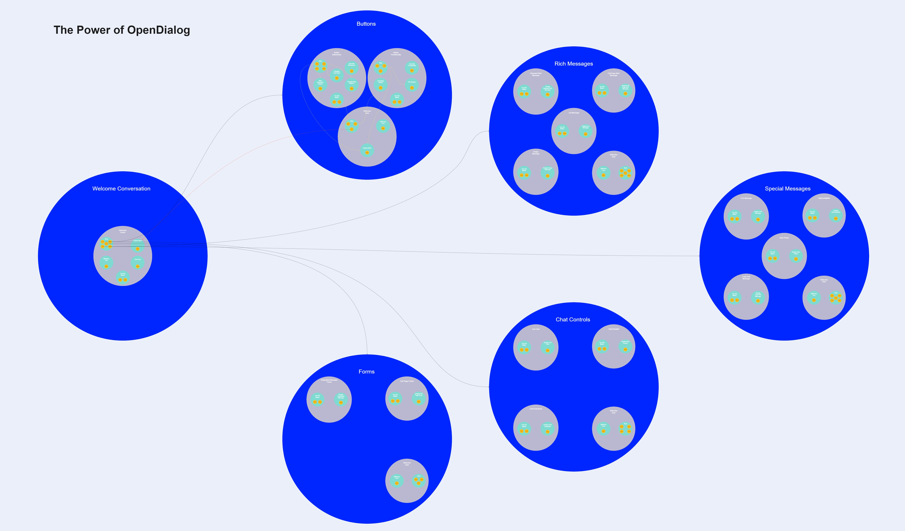

# Lesson 1: Conversational Map Design

## Overview



This lesson will focus on creating the conversational map of our bot by:&#x20;

1. Creating a scenario
2. Creating conversations
3. Creating scenes
4. Creating turns

Here is an overview of the conversational map of The Power of OpenDialog.

## Step 1: Create A Scenario


A **scenario** is meant to encapsulate a set of related conversations focused on helping the user achieve a specific high-level goal.


.png>)

* Click on **Create New Scenario**.
* Name your Scenario.
* Describe your project goal.
* Click on **Create Scenario Button**.

.png>)

## Step 2: Create Conversations

Now for the first level down the hierarchy. We’ll take a look at creating conversations.


**Conversations** capture the exchanges for smaller specific goals on the way to the larger scenario goal.


Now, suppose we were to think of the overview of our bot. In that case, it will primarily focus on helping users view and understand what particular user interface features are available to them. This includes buttons, rich messages, specific messages, forms, and chat controls. **Our objective for the tutorial will be to expose the user to the capabilities of the various interface features.** We shall use these objectives as conversations that will be contained in our scenario.

We will only be covering one conversation in this tutorial, the 'buttons' conversation.

* Click on the "+" button to add a conversation
* Give it the name "Buttons"

.png>)

And that's it, you've done your first high-level conversational design.

## Step 3: Create Scenes


**Scenes** focus on even smaller aspects of a conversation containing different stages of a single conversation.


Let's start with buttons. In this case, buttons can be divided into finding out about the different button behaviours or functionality. So those will be our scenes.

### Welcome User Scene

* Click on the "+" button to add a scene
* Add the scene name "Welcome User"
* Select "Starting" under the behaviour category, as we will want the conversation engine to consider this scene as the entry point to the "Buttons" conversation
* Click save

.png>)

### Button Behaviour Scene

* Add scene name "Button Behaviour"
* Don't select Starting behaviour
* Click save

.png>)

### Button Functionalities Scene

* Add scene name "Button Functionalities"
* Do not select Starting behaviour
* Click save

.png>)

Now that we have gone through how to do this for the buttons conversation, you could try break down the other four conversations according to the image of our overall conversational map provided earlier.

Once you've created scenes for the other conversations, we are now left with one more step to building the overall conversational context.

## Step 4: Create Turns


**Turns** capture single exchanges and consist of the user and application exchanging intents.


In our case, there are two types of turns. Turns that are directly related to the objectives and turns of the scene are used to navigate the conversation.

### Welcome User Scene

#### Welcome Turn

Welcome's the user.

* Click on the "+" button to add a turn
* Add turn name "Welcome Turn"
* Select starting
* Click save

.png>)

#### Next Turn

This turn shall be used for scene navigation as it enables us to transition into the other different scenes within the conversation in our case Button Functionalities and Button Behaviours and other conversations.

* Add turn name "Next"
* Select open behaviour because it enables this turn to be considered while we are in the scene.
* Click save

.png>)

#### Explore More

Provides the users with the options to navigate to different conversations. (More on this in the next lesson).

* Add turn name "Explore More"
* Select open behaviour
* Click save

.png>)

### Button Functionalities Scene

#### Describe Functionalities

This turn's objective is to describe the different button functionalities that are available which includes the simulating intents and the URL button.

.png>)

#### URL Buttons

This turn's objective is to showcase or demoing the URL button's functionality.

.png>)

#### Simulating Intents

This turn is similar to the URL Button's turn except that in this case it showcases the simulating intent functionality.

.png>)

#### Next

This turn's objective is to navigate within the scene, in this case it would be the means to navigate to the Simulating Intents turn, URL Buttons turn and the other button features.

.png>)

### Button Behaviours Scene

#### Describe Behaviours

.png>)

#### Main Interaction Buttons

.png>)

#### Disappearing Buttons

.png>)

#### Disabled User Input

.png>)

#### Next&#x20;

.png>)

And that's it; you've just completed a high-level design of The Power of OpenDialog, giving our bot an essential aspect of conversational context.
