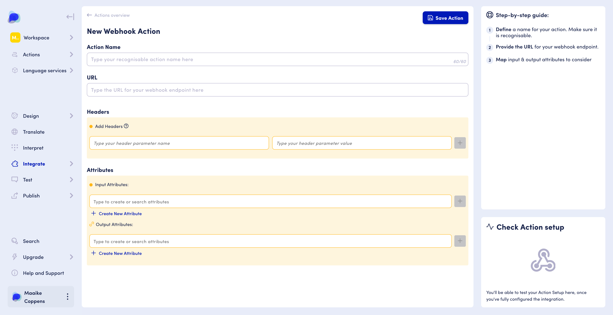
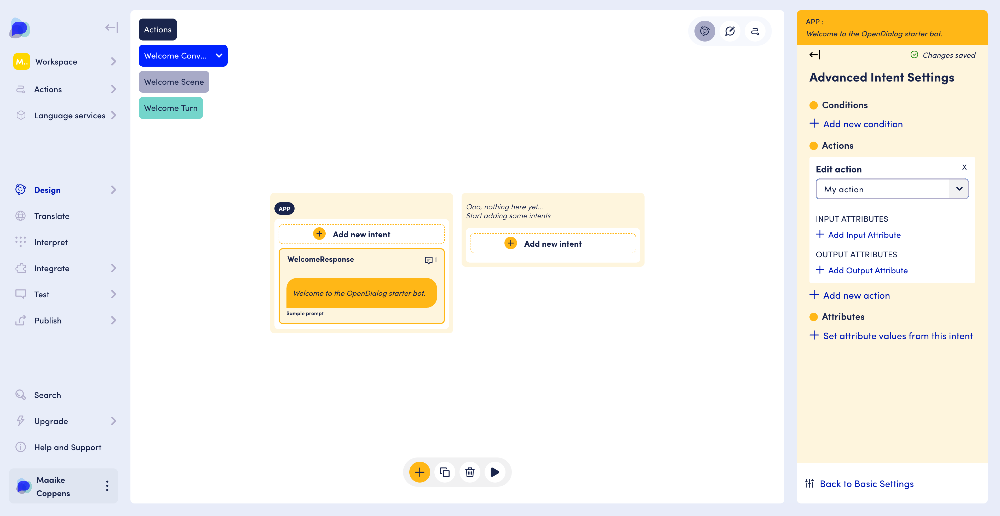

# Add a 3rd party integration

## Introduction

Throughout the course of a conversation, we may want to communicate with systems outside of OpenDialog to send or receive data. This may be as simple as a "ping" to a URL representing a milestone in the user's journey, or an integration with an external data source which takes some input data from the conversation, and outputs some new data to return to the conversation.&#x20;

OpenDialog communicates with 3rd party systems in 3 ways:

* with LLM's through **LLM actions,** which we covered [here](../getting-started-1/quick-start-ai-agents/the-start-from-scratch-ai-agent/supporting-llm-actions.md) and you can learn more about [here](../opendialog-platform/interpreters-and-natural-language-understanding/llm-actions/).
* through **prebuilt actions**, which you can read more about [here](../designing-conversations/actions/actions-from-library/).
* through **custom actions**, which we will be using for this tutorial guide.

### What you need before you build

The webhook action allows you to send and receive data from an external service via a HTTP POST request to a provided webhook URL.&#x20;

Some of your favorite third-party tools like Calendly offer API functionality, and you can find the webhook URL and your personal access tokens through your account settings.

If you don't have a service set up for your own custom systems, reach out to an engineering friend to get you set up.


For some more details around the data structures you can use please see the [Integrating with OpenDialog](../developing-with-opendialog/introduction.md) section.&#x20;


## See it in action

_Video coming soon_

## Step by step guide

Once you have a service that provides the desired functionality, it's time to create your action in OpenDialog.&#x20;


**Navigate to the Actions overview**

* Navigate to your scenario via the workspace navigation panel
* Hover over Integrate
* Click on Actions
* View the Actions overview page
* Click on Create a new webhook integration


<figure><figcaption><p>Navigate to the webhook action screen</p></figcaption></figure>

### Set up your new webhook action

Remember, you will need a webhook URL to interact with either provided by your engineering team or the third party tool you wish to interact with directly.

_For this tutorial, we will be using a mock webhook example, available through Postman_ [_here_](https://www.postman.com/opendialogai/opendialog-s-public-workspace/request/48m0k3s/webhook-endpoint)_._&#x20;


**Name your action and add it's webhook endpoint**

* In the input field on the top of your screen, under Action Name, give your Action a unique name - so you can easily recoginise it throughout your scenario setup.
*   Now add the webhook URL that the action will need to interact with

    _Example:_&#x20;

`https://af7df53c-9871-40de-a454-31d5cf2d6237.mock.pstmn.io/your-webhook-endpoint`


<figure><figcaption><p>A webhook action</p></figcaption></figure>


In the **Headers** section you can setup and authentication token required and you can also send headers that include conversation attributes such as the user's ID.&#x20;


### Set up the input and output attributes

N**ow, we can set up the input and output attributes we want to send and retrieve via our action.**&#x20;

* **Input attributes** contain the information we will be collecting from our scenario and sending to our webhook endpoint.
* **Output attributes** contain the information we get back as a result of the action being performed.

For more information on attributes, check out the documentation on attributes [here](../core-concepts/contexts-and-attributes/about-attributes.md).

<figure><figcaption><p>Adding attributes to your action</p></figcaption></figure>


**Set up your input attributes**

* Under the Attributes section of your screen, click in the input field under the 'Input attributes' header
* Start typing and a dropdown with all existing attributes will appear
* Select the input attribute you are interested in, _for example: first\_name_ and _last\_name_
* Or create a new attribute by clicking on 'Create new attribute'
* Hit the + icon at the end of the input field to confirm adding this input attribute
* Add all the input attributes you will be providing for this action


Once we have added our input attributes, we now need to configure the information we are expecting back as a result of our action once it has run.  We do this, using output attributes.


**Set your output attributes**


* Under the Attributes section of your screen, click in the input field under the 'Output attributes' header
* Start typing and a dropdown with all existing attributes will appear
* Select the output attribute you are interested in, _for example: full\_name_&#x20;
* Or create a new attribute by clicking on 'Create new attribute'
* Hit the + icon at the end of the input field to confirm adding this output attribute
* Add all the output attributes you will be providing for this action


Using the examples as listed in the instructions - the action we have set up will:&#x20;

* retrieve the values for the first\_name and last\_name attributes in the scenario
* upon running the action, will provide the service with the values against first\_name and last\_name
* will return the value for full\_name&#x20;

### Test your action

Now, we can test our action by providing values against the input attributes, and check the result the webhook action comes back with.

<figure><figcaption><p>Testing a webhook action</p></figcaption></figure>


**Test your action**

* In the right-hand panel, click the "Test action using Json" button in the middle of the screen
* Update the .json field in the editor that appears&#x20;
  * Replace the `"attribute"` with the name of your first input attribute
  * Replace the `"value"` with a mock value, for example "John"
  * If you have multiple input attributes, separate them out with commas
* Click Run Action Test using the navy blue button on the bottom of the right-hand panel


#### Example

```
{
  "first_name": "John",
  "last_name": "Smith"
}
```

If all goes well, you will get a succesful response back with the preset values from the endpoint.


**Save your action**

* Scroll back up to the top of the screen, if you haven't already
* Click on the 'Save Action' button in the right-hand corner of the central panel
* Your action is now saved and you are taken back to the action overview page


### Add your action to the conversation design

To execute the action at a particular moment in the conversation, we need to add it in the conversation design to the intent we want the action to run on.


**Navigate to the design section**

* Use the navigation menu on the left-hand side of your screen
* Hover over the Design section
* Click on 'Conversation'
* Navigate to the intent you wish to run the action on, using the filter buttons in the top left corner of the central panel, or the conversation nodes in the centre.


With your action set up and your intent selected, let's set them up to work together!

<figure><figcaption><p>Adding an action to an intent</p></figcaption></figure>


**Adding an  Action to an intent**

* View the intent settings  panel
* Locate “Add conditions, actions & attributes” on the bottom of the panel
* Click the link
* In the Actions section of the panel, select Add new action.&#x20;
* Select your newly created  action by its name in the dropdown
* The updated intent settings will Autosave


You are all set! When your scenario matches this intent, your action will be run and the related output attribute will be populated.&#x20;

### **Use output attributes in messages**

You can use the value of output attributes from your action in your messages, to further personalise them. For example, if you want the welcome message to refer to the user by their name. To do so, we will need to update its message in the message editor, to reference the specific output attribute.&#x20;


**Updating your message to use an attribute in it's response**

* Go back to the Basic settings using the link on the bottom of the panel
* Click the Edit Messages button in the panel
* Click the Edit icon on the message card&#x20;
* Locate the text block&#x20;
* Locate the place in your message where you want to add the information from output attribute
* Type an opening curly brace { to access the attribute autocomplete field
* Start typing the name of your output attribute, for example full\_name
* Select the desired attribute from the dropdown, in our case: full\_name
* Scroll back up to the top of the page
* Click “Save Message”


<figure><figcaption></figcaption></figure>

You have now succesfullly added an integration to your scenario, and used it's output in your messages! &#x20;

