# Simple FAQ Application

In this tutorial we are going to have a look at how we can:

* design a basic FAQ flow using several OpenDialog components
* move through that flow using the OpenDialog default interpreter
* introduce natural language interactions for prototyping before we connect NLU interpreters. 



### Setting up your scenario

Head on over to the 'Designer' and start [creating your 'Simple FAQ' scenario](../getting-started-1/getting-started-with-opendialog/creating-a-scenario.md): give your scenario a name, as well as a description.

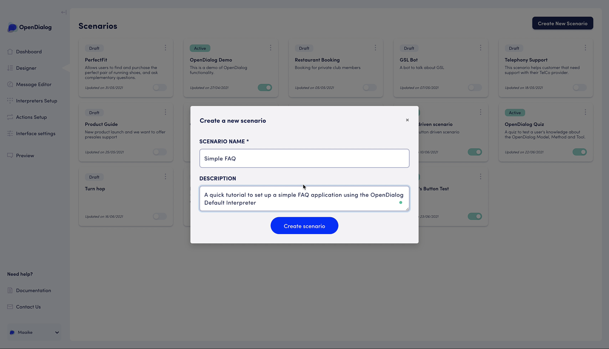

Think about what Conversations there are to be had.  OpenDialog comes with a few conversations out of the box: a Trigger conversation \(for the user to trigger the conversational application\), a Welcome conversation \(in which the application welcomes the user\), and a No-match conversation \(in case the user request is misunderstood or unhandled by the conversational engine\).

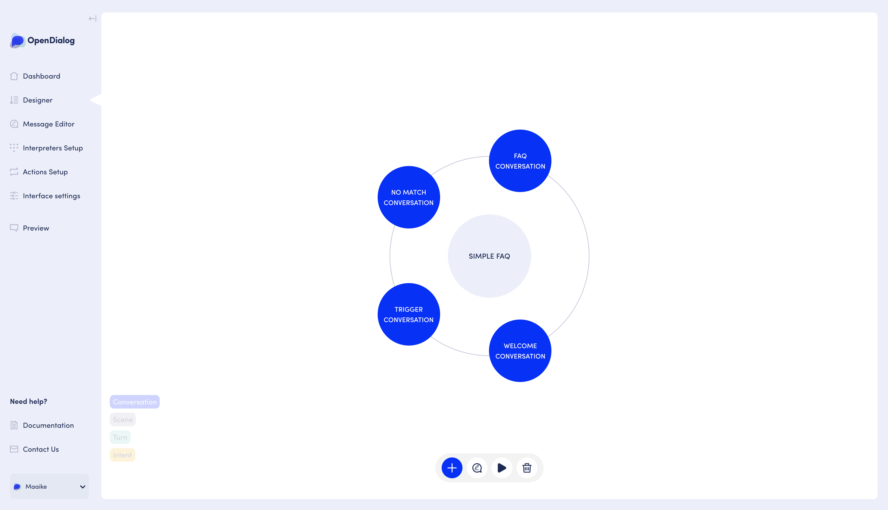

👉 In our example, we will also need an FAQ conversation to hold all our question-answer pairs.

### Create your FAQ conversation

[Add another conversation](../adding-conversations.md), by hitting the + button in the navigation bar below.

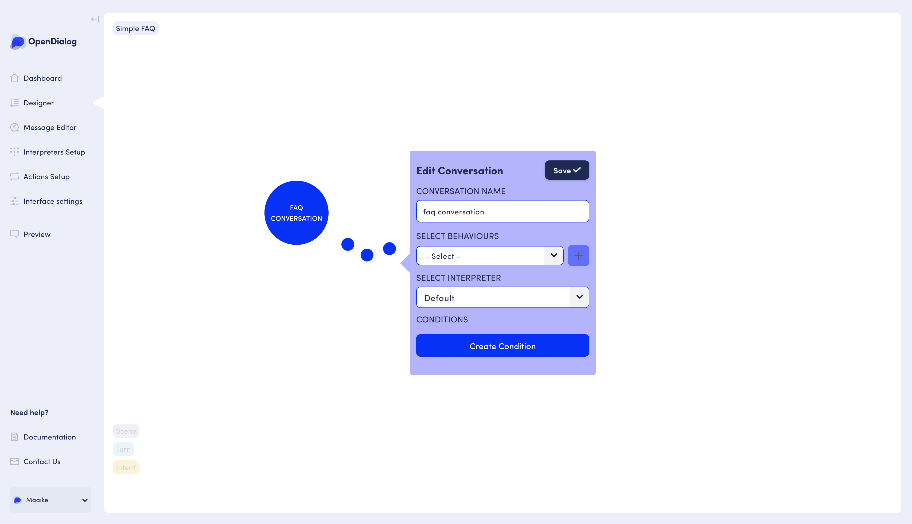

You are now asked to name your conversation - in our case 'FAQ Conversation'.  You can also set an interpreter, a behaviour and add conditions.  In our case, we will be using the [Default Interpreter.](../interpreters-and-natural-language-understanding/default-interpretor.md)  No need to worry about conditions or behaviours quite yet. You can go ahead and save your 'FAQ Conversation'

### Add scenes, turns and intents

Within your FAQ conversation, you will want to cover different topics such as; returns, account management, product information, ...

Each subtopic in OpenDialog can be set up as [a scene](../scenes.md).  Open the FAQ conversation, go ahead and create a few scenes for each subtopic you would like to cover in your FAQ conversation.

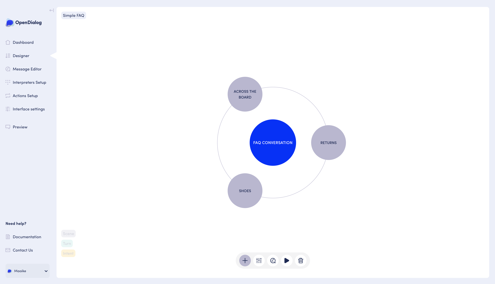

Give each scene ****[**a starting behaviour,**](../scenes.md) so that the conversation engine will consider them all as 'conversation starters’.  For more in-depth information on behaviour, check out the [linked article](../scenes.md)!

Finally, [**Turns**](../turns-and-intents.md) capture single exchanges. In our FAQ application, these are our question-answer pairs.  Make sure to give each turn [a starting behaviour](../turns-and-intents.md#starting-turns), so that the conversation engine considers them when entering their parent component: the scene.

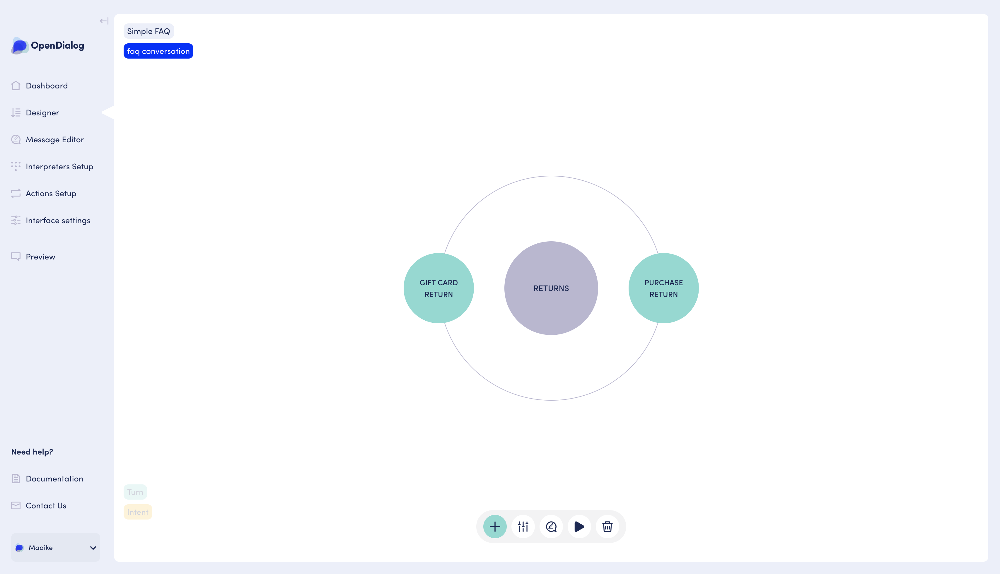

👉 **In our example:** Within the FAQ conversation - set up a 'Returns' scene, with a 'Return purchase' turn.

Now is the time to start adding our questions and answers to the information architecture we have set up.  We will do this using [request and response intents.](../turns-and-intents.md#intents-in-turns)

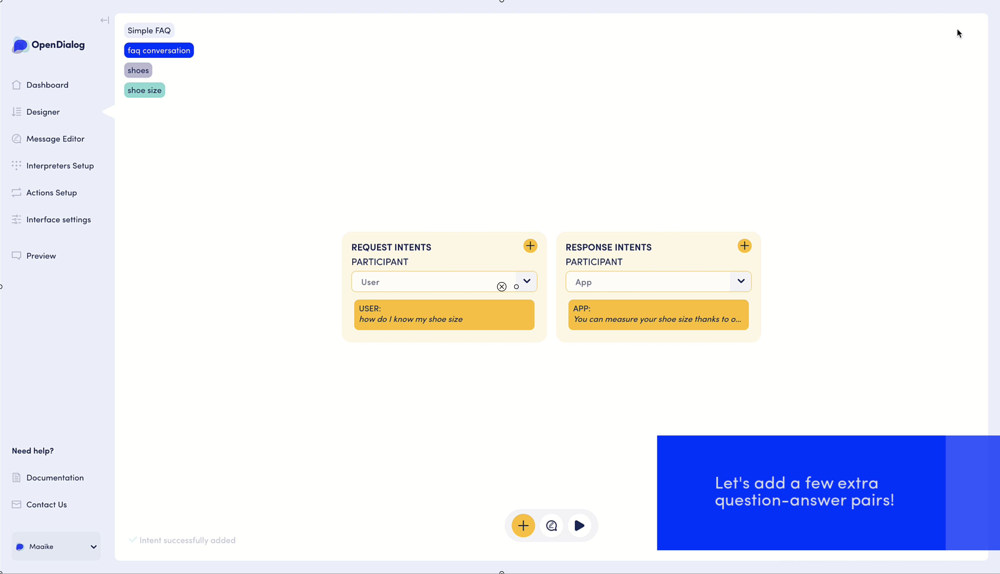

👉 Our FAQ conversation is a user-driven conversation.  This means that the participant submitting the request is the User \(versus bot-driven conversation where the app is the one submitting the request\). As so, the request intent is the user's question and the response intent the application's answer to that particular question.  Within the 'Return purchase' turn, set up the request intent and response intent.

In our example, the request intent is the user's question and the response intent the application's answer to that particular question.  Within the 'Purchase return' turn, now set up a request intent and a response intent.

You can set up an intent by clicking on the + symbol in the navigation bar, or directly in the Request Intent box.  A third panel will open in your browser, allowing you to add information to your intent.

Add a sample utterance \(what the user might say\), add an intent name \(the exact thing you expect a user to ask - at least for this basic tutorial\*\), and save your request intent.


In further applications, you can name your intent more systematically as you will be using an NLU interpreter - allowing for more flexibility in your model.  For quick prototyping, using the Default Interpreter - you need to use the exact wording you want to work with. To be noted: The Default interpreter is case sensitive.


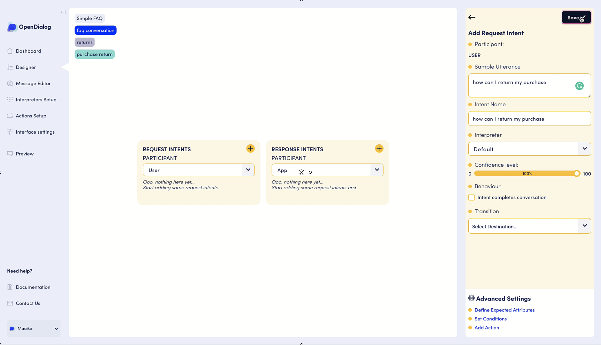

Now add your response intent from the application, indicating in your sample utterance what the application will reply to the user.  

💡Name your intent so that you can easily recognize it later.  Each response intent has an outgoing message tied to it.  Good naming will allow you to easily find your messages in the message editor!

Your response intent ends that specific turn, and you need to tell the conversation engine what to consider next in the application's scenario - using [a transition](../turns-and-intents.md#transitions).  

👉 Because we only have one main conversation in this example, we will ask the conversational application to transition to the top of that 'FAQ conversation' so that it can consider other topics \(scenes\), or question-answer pairs \(turns\) the user might want to enquire about.

Set up a few more scenes, turns, and intents for different question-answer pairs - see the video tutorial for examples.

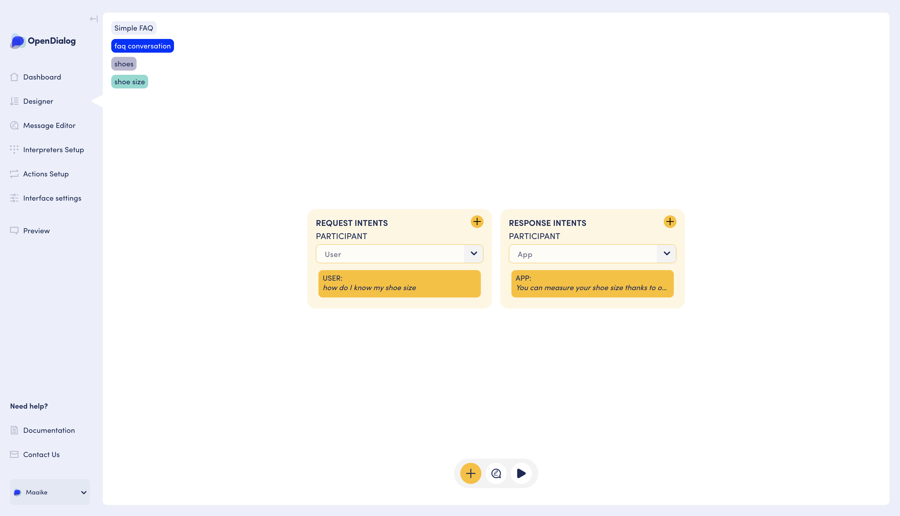

### Edit the 'Welcome Conversation'

In OpenDialog, every scenario comes with a 'Welcome Conversation' out of the box.  You need to edit and personalize this welcome conversation, depending on what you want to achieve.

In order to do so, in the Designer, navigate to :

Welcome Conversation &gt; Welcome Scene &gt; Welcome Turn &gt; Intent Overview

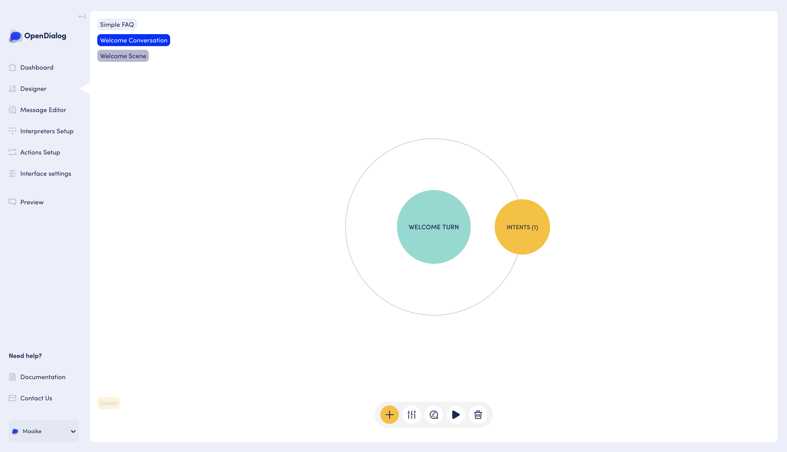

Here is the Welcome turn of the Welcome conversation.

* The Application says hello to the user
* The Application then listens for a user request from the 'FAQ conversation'

There is both a request and a response intent, and if you click on either of them none transitions or completes. That means we are going to be stuck in this turn indefinitely. 

👉In our example, we are using a user-driven pattern - meaning that the welcome conversation \(which is naturally app-driven\) needs to be adapted to reflect that.

What we want to accomplish is the following :

Let's fix that by first deleting the response intent \(we don't need it as we handle user responses in the FAQ conversation\).

Click on the response intent and then click on the trash can to delete it. 

 Now, let's fix the request intent. We want it to transition to the FAQ conversation so that the conversation engine will consider  the FAQ conversation as the next component. To do so, click on the application's initial request intent to edit it.  Set up this intent \(called intent.app.welcomeresponseforsimplefaq\) to transition to the 'FAQ Conversation'.

### Edit the Welcome Message

You're almost there!  In order to reflect these changes, and also do some nice wordsmithing, you can edit all the outgoing messages in the message editor!

Messages are associated with what we call "outgoing intents". Outgoing intents are intents that the application has. They are sent to the user, but of course, the user does not receive an intent. The user receives a message that carries the application's intent. Just as the application receives a message and attempts to map it to an intent. The relationship is mirrored, which makes it consistent and coherent. 

Now navigate to [the message editor](../messages.md) - either from the sidebar menu or directly from within the designer and the intent you wish to edit the message for - using the 'bubble with a pen inside' icon in the action bar.

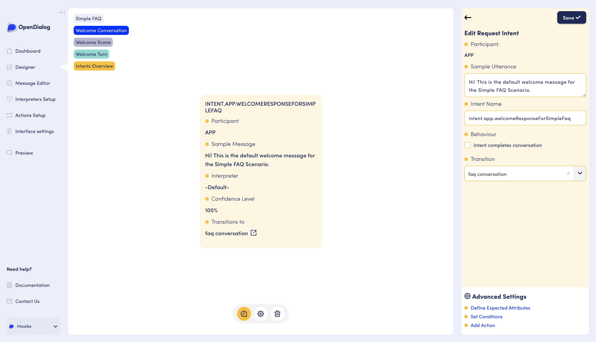

You can do a lot of interesting things with messages - give them a specific name, add conditions,...

👉Let's keep it simple for this first example, and edit the 'intent.app.welcomeresponseforsimplefaq' message, to be an open-ended question.  For example: "Hello, how can I help you?" - inviting the user to ask their FAQ-question. Give the message a specific name, for example 'General Welcome Message'.

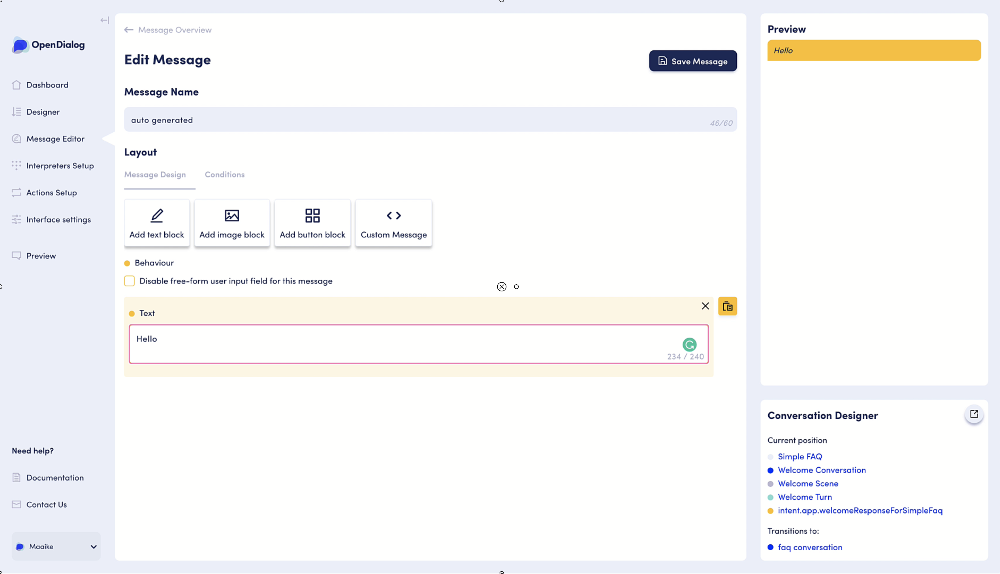

Almost done! Make sure to click on 'Save Message' before navigating back to the Designer!

### Activate your scenario

Navigate to the designer and find your scenario in the list. Click on the slider to active your Scenario \(it should now be green\). You're Scenario is now active! You're ready to test it.

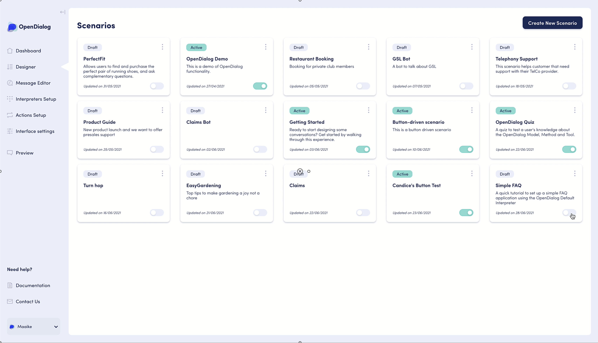

To test your application navigate to the 'Preview' section and select your Scenario from the drop-down menu. You should then see WebChat appear with the welcome response you created.

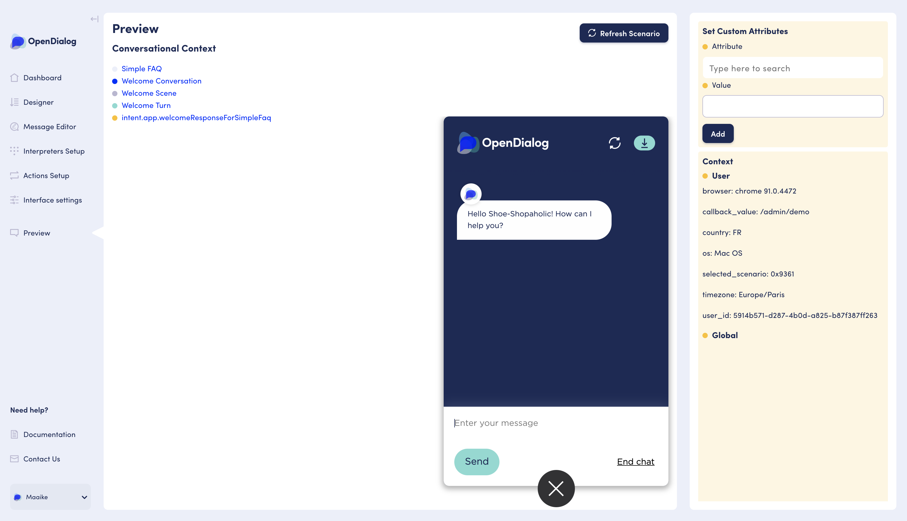


Remember when testing the NLU simulation it needs to exactly match what you set up as the intent name e.g "how can I return my purchase".

👉  intent names are case sensitive! 


Congratulations! You just created your first quick FAQ prototype simulating NLU. Our next step will be to integrate some actual NLU and start designing some more complex conversations! 

Let's recap the main points:

* You start by creating a new scenario
* Setup the conversations to be had
* Design your scenes and turns, taking care around what is a starting scene and starting or open turns
* Check your conversations flows to make sure it all behaves as you would expect.
* Finalise your messages with the right tone of voice.
* Activate your scenario and test the real thing in Preview before [launching to your website](../launching-your-application.md). 

While the default callback interpreter is essential for button-driven interaction and can help with simple prototyping,  for actual NLU we need to use an [NLU interpreter which we discuss here](../interpreters-and-natural-language-understanding/dialogflow-interpreter.md). 

