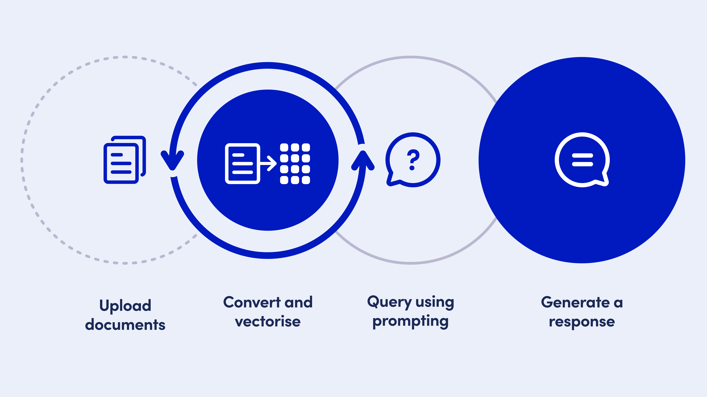
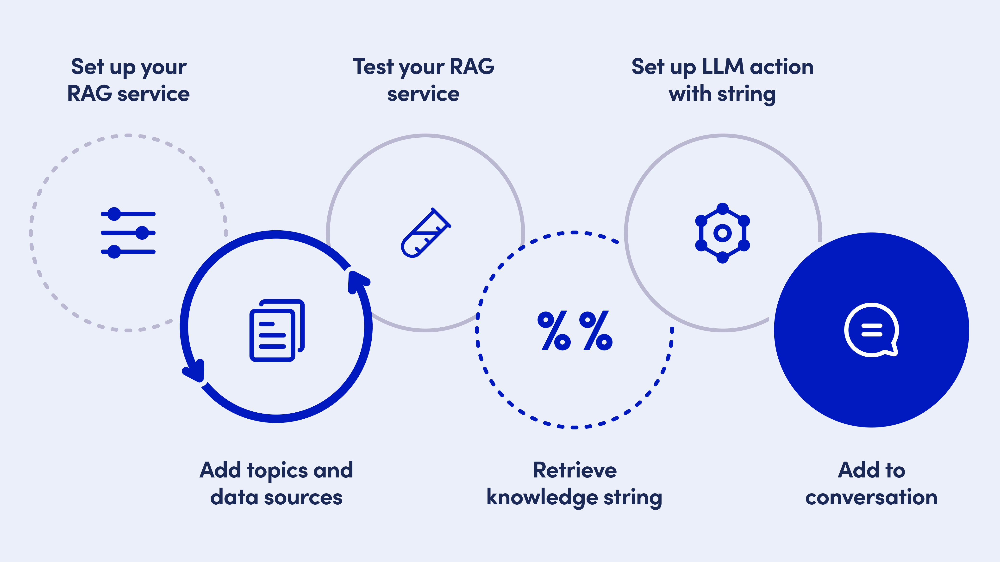

# Use knowledge sources via RAG

## Introduction

Now, we obviously want our AI Agent to provide more relevant and precise information to our users than just the static response you provided as an example.

If you want to use dynamic responses, you will need to take a few additional steps:

* Making sure the AI Agent has the necessary knowledge at hand to respond regarding your new topic of discussion by adding additional knowledge sources to your RAG service.
* Give the AI Agent the instructions to generate a dynamic response based on that knowledge by creating an LLM Action .
* Indicate to the AI Agent when to generate the response by referencing the LLM action on the correct response intent
* Adapt the AI Agent’s message to use the generated content by referencing the LLM action through an attribute in the message editor.

<figure><figcaption>
From RAG to responses
</figcaption></figure>

## **See it in action**


Follow this video to add and use a knowledge source for RAG


## **Step by step guide**

<figure><figcaption>
Overview of adding and using a knowledge service
</figcaption></figure>

### **Adding knowledge: Knowledge Services (RAG)**

As a first step, you’ll need to add relevant content to your RAG service.  Let’s walk through the process of adding and setting up an additional knowledge source.


**Navigate to your prebuilt RAG Service**

* In the left-hand navigation panel, click on Language Services
* Locate your prebuilt RAG service, labelled “ProjectName Knowledge”
* Click on the link to navigate to the service


\
Within the RAG/ Knowledge service, you’ll see predefined topics and existing knowledge sources that were uploaded during the initial setup. Now, let’s add a new topic for your AI Agent to reference, related to your new topic of discussion.


**Adding a new knowledge topic**

* Click the Add Topic button in the top-right corner
* Enter a name for your topic, such as “AboutCompany”
* Provide a brief description of your topic aligned with the one you used earlier

_Example: “Information about the brand, organisation, and related services.”_&#x20;

* Click ‘Create Topic’ to save


\
Now, with your new topic created, it’s time to begin adding sources to it. OpenDialog provides you with the ability to choose from a variety of different source types.

* URL: Link to a URL page that has information relevant to your topic.
* Document: Upload relevant documents.
* Text: Manually enter text as a knowledge source.


**Adding knowledge sources to your topic**

* Click the Add sources button in the centre right of the screen
* Select the source type you want to add (URL, document or text)
* In the pop-up, follow the instructions
* Click ‘Upload source’ to continue



Note - For Microsoft Word documents, we only support `.docx` file formats. If you have an older style `.doc` file, please resave as a `.docx` file before trying to upload to your knowledge source&#x20;


### **Vectorize your knowledge source**

\
To ensure the AI Agent can efficiently use the information you  just added, you will need to transform its information into a machine readable, numerical format, this is called vectorisation.&#x20;


**Vectorizing your knowledge sources**

* Select one or more knowledge sources using the select box next to it
* Click the Vectorize button in the action menu above the knowledge source table
* Confirm the vectorization in the pop-up
* View the updated vectorisation status in the knowledge source table&#x20;


Via this action menu, you can also delete a knowledge source or set a schedule to re-vectorize sources that update frequently, ensuring your AI Agent always has the latest information.

### **Retrieving your knowledge string**

In order to use the vectorised knowledge in your conversation design setup and LLM Actions later, you will need the ability to  reference it.  In OpenDialog, you do this using a knowledge string.

A knowledge string follows this syntax: %%RAGServiceName.TopicName%%

For example: %%SpaceKnowledge.AboutCompany%%&#x20;

For ease of use, locate the knowledge string for your new topic of discussion in the right-hand test panel and copy/paste this string into a note or blank document for further use in LLM Actions system prompts.


**Save your new knowledge topic and its sources**

* Scroll up to the top of the screen
* Click 'Update Topic' to save your changes


### **Providing instructions : LLM Actions**

In order to use your new knowledge source in a response, you will need to accomplish three more steps:

1. Create an LLM action to provide the Large Language Model with instructions on how to use your knowledge sources to generate responses.&#x20;
2. Indicate to your AI Agent when to trigger a response generation by adding this LLM action to the app response intent&#x20;
3. Reference the output attribute for this LLM action in the response message


**Navigate to LLM Actions in your scenario**

* In the left-hand navigation panel, hover 'Scenarios'
* Select your “ProjectName” scenario in the list of scenarios
* Hover over ‘Integrate’ in the updated navigation panel
* Select LLM Actions


Once in the LLM Actions overview, you’ll see prebuilt actions like “Topic Response Generator”, for example, which were automatically created to generate responses for your primary topic. We will be using this LLM action as a basis for our new LLM Action.&#x20;

Let’s have a look at what this “Topic Response Generator” LLM action looks like.\


**View a pre-existing LLM Action**

* In the LLM Action overview, locate the “Topic Response Generation” LLM Action
* Click on the card


An LLM action is made up of 3 main components:&#x20;

1 - the **LLM engine** that powers it, visible under the Engine settings tab

2 - the **prompt configuration** that provides the LLM with instructions, under the prompt configuration tab, and further settings that allow you to determine how the LLM response will be referenced thanks to output attributes.

3 - **guardrails** to constrain the LLM responses and configure their safety settings, under the safeguarding tab.\

In this initial guide, we are not going to dig any deeper into the preconfigured prompt configuration just yet. All you need to remember for now is that:

* A knowledge source gets referenced in prompt instructions using a knowledge string
* The knowledge string is used in the prompt instructions in a specific knowledge sections, indicated as follows: \<knowledge>
* The LLM response that comes back when the action is run is saved in OpenDialog under an output attribute which by default is the {llm\_response} attribute

For more information on how to structure prompt instructions for LLM Actions, you can take [a look at our further documentation](../opendialog-platform/interpreters-and-natural-language-understanding/llm-actions/).\

For this initial setup, we will use the same configuration as the ‘Topic Response Generation’ LLM Action.


**Duplicate an existing LLM Action**

* Navigate back to the LLM Action overview using the link in the top-left corner of the central panel
* On the 'Topic Response Generator Card' click on the 3-dotted menu
* Select Duplicate


Now let’s taylor our new LLM action and provide it with instructions to reference our newly setup knowledge source.

👉🏻 You will also need the knowledge string you put aside earlier.\


**Editing an LLM Action**

* Click in the newly created LLM Action
* Edit the name of your LLM Action, eg. “About Company Response Generator”
* Edit the description to specify that this action generates responses for your topic.
* Select the LLM  Engine you wish to use (\*)&#x20;


_(\*) The same configuration of the LLM Action you have duplicated will apply. When selecting the OpenAI engine, the correct configuration will already be selected. You can use an OpenDialog-managed account, or use your own account credentials._

Now, we are going to update the prompt instructions in order to adapt to the additional knowledge source you have just added. \


**Updating  prompt instructions**&#x20;

* Navigate to the ‘Prompt Configuration’ tab
* Go to the system prompt input field
* Paste the prompt instructions you copied earlier, using Cmd+V (or Ctrl+V)
* Locate the knowledge section in the prompt instructions, \<knowledge>
*   Replace the mentioned knowledge string to your newly added topic.

    For reference, it is formatted as follows: %%ServiceName.TopicName%%
* Scroll back up to the top of the page
* Click the ‘Save action’  button


### **When to trigger a response: adding an LLM Action to a response intent**

You are now ready to return to your conversation design and update the response intent with your LLM Action.&#x20;

To do so, navigate back to the Design section of your scenario, by clicking Design in the navigation bar and then Conversation. Now, using the filter buttons  in the top left corner of the central panel, or the conversation nodes in the centre, navigate back to the topic intent you set up earlier. &#x20;

Topic conversations > About Company > About Company > Intents>AboutCompanyResponse


**Adding an LLM Action to an intent**

* View the intent settings  panel
* Locate “Add conditions, actions & attributes” on the bottom of the panel
* Click the link
* In the Actions section of the panel, select Add new action.&#x20;
* Select your newly created LLM Action by its name in the dropdown
* The updated intent settings will Autosave


You are all set! When your scenario matches this intent, your LLM prompts will be sent to the language model and the related llm\_response attribute will be populated.&#x20;

### **Adapting the message: the LLM response attribute**

To display the LLM's response text in your scenario, we will need to update its message in the message editor, to reference the {llm\_response} attribute. Remember, this is the attribute where the LLM’s response generated by your LLM action gets stored in OpenDialog.


**Updating your message to use the dynamically generated response**

* Go back to the Basic settings using the link on the bottom of the panel
* Click the Edit Messages button in the panel
* Click the Edit icon on the message card&#x20;
* Locate the text block&#x20;
* Delete the static message in the text block
* Type an opening curly brace { to access the attribute autocomplete field
* Start typing llm…
* Select the desired attribute from the dropdown, in our case: llm\_response
* Scroll back up to the top of the page
* Click “Save Message”


Your new knowledge source is now ready, and the AI Agent is set to generate informed responses based on the enriched content.

Your additional topic is now live! With these steps, you can empower your AI Agent to handle a wider range of user questions while maintaining a smooth, relevant conversation flow. To add more additional topics, go back to the top of this guide, rinse and repeat!

\
