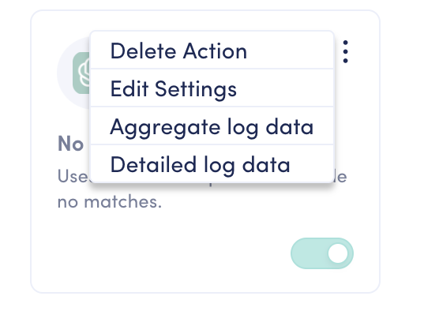

# Constructing Messages

In OpenDialog, messages are the primary means of interaction between your conversational interface and its users. Understanding how to use the various message blocks available within the platform is crucial for crafting effective and engaging interactions.

## Designing a message

Message blocks are modular components that can be combined to form a complete message. Each block serves a specific purpose, allowing you to tailor your messages to the needs of your users and the goals of your application. By leveraging these blocks, you can construct messages that are not only informative but also interactive and user-friendly.

To design your message, click on any message block(s) to add those to the designer. You will see each of them appear, one after the other. You can then go ahead and add your message content as required.&#x20;

Each block can be deleted, duplicated, or reordered using the relevant icons.&#x20;

<figure><figcaption>
Individual message screen to design your message
</figcaption></figure>

## Combining message blocks

When constructing a message in the message editor, you don't just have the option of using only one message block. You can use a variety of different message blocks per message, to mix and match and convey what you want to say in a variety of different ways.

However, when you are putting certain message blocks together, there are a number of rules that you need to follow. This is because certain message blocks need to be in a certain position when being compiled with others. Below, some of the main rules have been highlighted for specific block types:

#### [Form message](message-types/form-message.md)

You can only add one form message type to each message, and it should be the last message in the list.&#x20;

#### [Autocomplete message](message-types/autocomplete-message.md)

When using an autocomplete message with other message block types, these must be the very last in the list. &#x20;


Note that the autocomplete message will cause the user input field to be taken over by an autocomplete modal.


#### [Full page messages](message-types/full-page-message.md)

As a general rule for setting up messages with multiple blocks, it is always best practice to put any full-page messages to the end of your list. The full-page messages are:

* [Full page form messages](message-types/form-message.md)
* [Full page rich messages](message-types/full-page-message.md)
* [Location messages](message-types/location-message.md)
* [E-sign messages](message-types/e-sign-message.md)

## Reordering message blocks

Within every message type, there is also a drag-and-drop feature for you to use.&#x20;

<figure><figcaption></figcaption></figure>

To access the drag-and-drop feature, go to the top left corner of any message block and click on the icon with six dots.

From here, you can grab and move your message block to its desired place.

## Design best practices

### Bite-sized information is easier to read

A single turn may include several pieces of information. For instance, it may include a welcome, some instructions, and some facts such as appointment information to verify during the interaction.&#x20;

It helps legibility if the information is provided in multiple messages (all within the same app intent).&#x20;

Notice the difference between the following screens:&#x20;

&#x20;  &#x20;

<figure><figcaption>
All text in a single message
</figcaption></figure>

 

<figure><figcaption>
Text divided up in smaller chunks for readability
</figcaption></figure>

### Words per app turn

How much information can be conveyed in a single app turn? This depends to some extent on the nature of the assistant and the interaction. Some turns convey a lot of information, and some can be quite concise.&#x20;

_For example, "Thank you. Is there anything else?"_

A key practice is to ensure that the content of a single turn does not exceed the screen height. In other words, the user should not have to scroll to view all the information shared in a single turn. Forced to do so requires effort from the user, who may hardly be aware that there is more information that scrolled up, and it breaks the easy reading experience.&#x20;

A rule of thumb in a typical OpenDialog assistant is to limit the text in a single turn (if the content consists entirely of text):

* 9 lines with buttons, ideally in 3 or 4 chunks
* Consider that on average, each line holds about 30 - 35 characters, or 5 to 6 words of average length (based on an average word length in English of 4.7 characters per word).

<figure><figcaption>
Example screen and content
</figcaption></figure>

Always test your assistant to make sure the content does not scroll up. Note that images or carousels take up a lot of vertical space, so be mindful of the amount of text you add before or after such an element in a single turn.&#x20;

### Accessibility

A key element to consider for all message types is [Accessibility](constructing-messages.md#accessibility), especially for messages that include customization with multimedia types such as buttons, images, and links. For all information on accessibility within OpenDialog, please click [here](../designing-accessible-chatbots.md).
