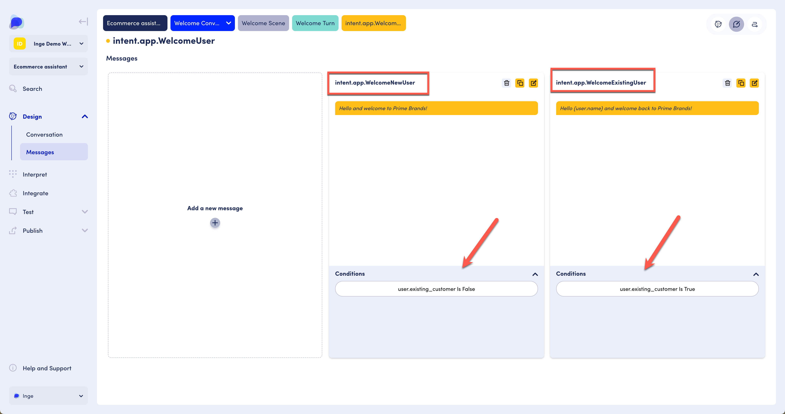

# Message Conditions

### Message conditions

Message conditions can be defined by clicking on Conditions in the Layout and adding context, attribute and other details. More information about context and attributes is a available in the next page on Attributes in Messages.&#x20;

<figure><figcaption></figcaption></figure>

<figure><figcaption></figcaption></figure>

We define conditions so that the system can evaluate which message to use. In the image below, two messages are associated with the intent called intent.app.WelcomeUser. The message called intent.app.WelcomeNewUser gets used when the user is not an existing customer. If they are, the message intent.app.WelcomeExistingUser is used. Existing\_customer is an attribute of the user context. More information about using attributes in messages can be found in the next page, "Attributes in messages".

<figure><figcaption>
Example of messages with conditions
</figcaption></figure>

Continuing our example above, where we want to show different messages to users depending on whether they are a new user or a returning user. To do this we would us Conditions to tell the system which message it should show depending on the value of attributes saved against the user.

For our example, then we would set the 'Attribute' to `seconds_since_last_seen` , 'Context' to `user`, 'Operation' to `Equals` and the 'Value' to '`0`' - meaning only show this message if the user has not been seen yet.

.png>)

Where as for the returning user, we would change the 'Operation' to be `Greater than`. Meaning only show this message if the user has been seen before.

.png>)

Conditions are really powerful for enabling personalised experiences for users. The key functionality that drives Conditions are Attributes and you find out more about them [here](../../designing-conversations/conditions-and-operators.md).&#x20;
