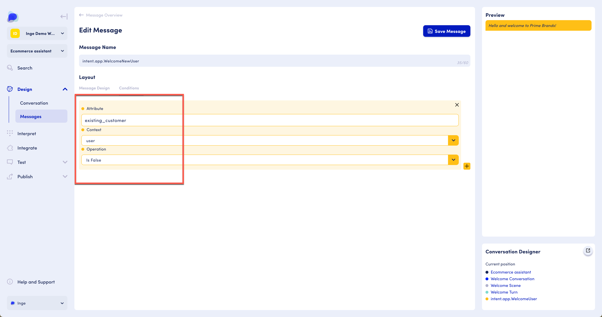

# Message Editor

## Finding the Message Editor

There are two ways to access messages:&#x20;

**Option 1:** The Messages functionality is available as part of the Design functionality. Design includes both Conversation, where the conversation design occurs and Messages, where we access the message editor and work on everything to do with the content and assistant prompts. If Messages is not viewable in the sidebar, click the carrot (down arrow) to the right of Design to expand.&#x20;

<figure><figcaption>
Design option - not expanded
</figcaption></figure>

<figure><figcaption>
Design option - expanded
</figcaption></figure>

**Option 2:** From within the Conversation designer, navigate to the Message editor by clicking on the message icon in a Scenario, Conversation, Scene, Turn or Intent. This will take you directly to the messages related to the conversational component you are on (scenario, conversation, scene, turn or intent)

<figure><figcaption>
How to find the message editor
</figcaption></figure>

## Finding specific messages

Which messages you see in the list of messages depends on the level at which you enter the Message Editor. For instance, if you entered the editor at the scene level, you would only see the messages for that scene. If you enter the editor at the highest level, you see all messages for the scenario.&#x20;

Messages are associated with intents. For instance, a welcome message can be associated with an intent called "Welcome".&#x20;

Several messages can be associated with a single intent. For example, for a Welcome intent, we can have a message specifically geared towards new users, and one geared towards existing users.

Our search functionality allows you  to edit a specific word, sentence, or message. You can use OpenDialog Search to find a message or group of messages that contain the exact phrases or words you're looking for.

You can access the 'Search' functionality in the main scenario menu, which searches for content throughout Intents and Messages.&#x20;

<figure><figcaption>
Search across Intents and Messaes using the search functionality in the main scenario menu
</figcaption></figure>

To search for a specific message, click on the 'Search' item in the main scenario menu, and the search modal will appear right in the middle of your workspace. Then, enter your query in the search bar, and the modal will display the results instantly.

<figure><figcaption>
Enter your search query in the search bar that appears when selecting Search in the main scenario menu
</figcaption></figure>

By clicking on the appropriate search result from the list, you'll be directed to the chosen component, giving you the opportunity to edit the selected message with ease.

<figure><figcaption>
Message catalog
</figcaption></figure>


Note that the displayed messages in the message catalog are the sample message you have defined upon intent creation.  The sample message is there to help you with the conversation design, and recognizing intents throughout the OpenDialog platform. When editing a message, this will not edit the sample message. &#x20;


## Adding or editing a message

In the intent list, click the Edit icon for an existing message or click "Add a new message". An existing message can also be copied or deleted:

<figure><figcaption>
Multiple messages associated with a single intent
</figcaption></figure>

The Edit Message screen allows us to change the Message Name and customise the layout using a number of different [message types](message-editor.md#message-types). These types are covered in the next pages of this section.&#x20;

The following options are available in the Edit Message screen:

*   **Message name:** the name is purely to help you identify specific messages. The message name will automatically be prepopulated with the name of the app intent it is related to. Make the message names something that is easy to recognize and place. For ease of use and recognition, define your naming convention upfront when you start creating your conversational application.&#x20;

    We recommend using the intent name, optionally followed by the condition if you are using one.&#x20;

    _For example: WelcomeIntent - userID unknown_
* **Layout: t**his is where you can build your message content, add conditions to your messages, and set behaviours such as disabling text input and hiding the app avatar&#x20;
* **Preview:** shows a preview of your message. More complex messages don't have a full preview available and are labeled in the preview by their message type.
* **Conversation Designer:** shows the current position in the Scenario where this message is located

<figure><figcaption>
Edit Message screen
</figcaption></figure>

### Designing a message

To design your message, click on any message block(s) to add those to the designer. You will see each of them appear, one after the other. You can then go ahead and add your message content as required.&#x20;

Each block can be deleted or duplicated using the relevant icons.&#x20;

<figure><figcaption>
Edit Message screen
</figcaption></figure>


[constructing-messages.md](constructing-messages.md)


<table data-view="cards" data-full-width="false"><thead><tr><th></th><th></th><th></th><th data-hidden data-card-target data-type="content-ref"></th><th data-hidden data-card-cover data-type="files"></th></tr></thead><tbody><tr><td></td><td></td><td></td><td></td><td></td></tr><tr><td><strong>Constructing messages</strong></td><td>Master the art of crafting powerful messages tailored to your specific needs, utilizing OpenDialog's diverse range of message types to their fullest potential.</td><td></td><td><a href="constructing-messages.md">constructing-messages.md</a></td><td><a href="../../.gitbook/assets/legoblocks.png">legoblocks.png</a></td></tr></tbody></table>

### Message conditions

Message conditions can be defined by clicking on Conditions in the Layout and adding context, attribute and other details. More information about context and attributes is a available in the next page on Attributes in Messages.&#x20;

<figure><figcaption></figcaption></figure>

<figure><figcaption></figcaption></figure>

We define conditions so that the system can evaluate which message to use. In the image below, two messages are associated with the intent called intent.app.WelcomeUser. The message called intent.app.WelcomeNewUser gets used when the user is not an existing customer. If they are, the message intent.app.WelcomeExistingUser is used. Existing\_customer is an attribute of the user context. More information about using attributes in messages can be found in the next page, "Attributes in messages".

<figure><figcaption>
Example of messages with conditions
</figcaption></figure>

Continuing our example above, where we want to show different messages to users depending on whether they are a new user or a returning user. To do this we would us Conditions to tell the system which message it should show depending on the value of attributes saved against the user.

For our example, then we would set the 'Attribute' to `seconds_since_last_seen` , 'Context' to `user`, 'Operation' to `Equals` and the 'Value' to '`0`' - meaning only show this message if the user has not been seen yet.

.png>)

Where as for the returning user, we would change the 'Operation' to be `Greater than`. Meaning only show this message if the user has been seen before.

.png>)

Conditions are really powerful for enabling personalised experiences for users. The key functionality that drives Conditions are Attributes and you find out more about them [here](../../designing-conversations/conditions-and-operators.md).&#x20;
