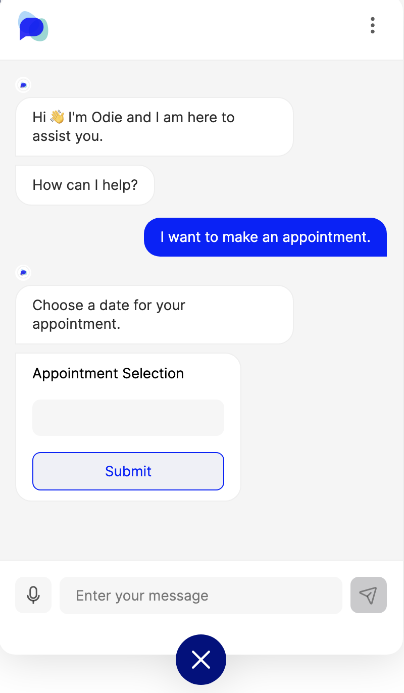
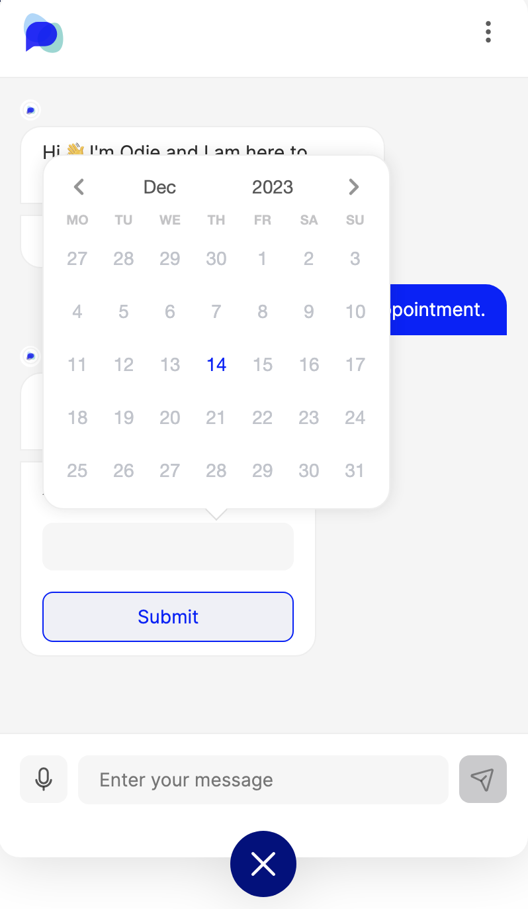
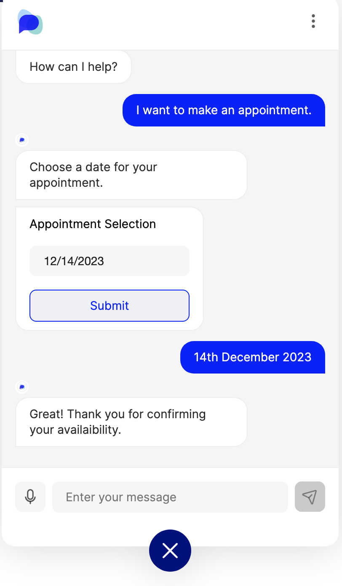

# Date Picker Message

## When to use date picker messages

Date picker messages simplify the process of inputting dates in a consistent format. This can often be challenging if you need to constrain the range of dates you would like to accept as input, or if you are serving an international user base with differing date formats. \


<div align="center" data-full-width="true">

<figure><figcaption><p>Users are prompted with a clickable input box.</p></figcaption></figure>

 

<figure><figcaption><p>When clicked, a calendar appears</p></figcaption></figure>

 

<figure><figcaption><p>After selecting a date it is entered into the input box<br>for the user's confirmation.</p></figcaption></figure>

</div>

## Other forms of date picker message

<div>

<figure><figcaption><p>Pick a time</p></figcaption></figure>

 

<figure><figcaption><p>Pick a date and time</p></figcaption></figure>

 

<figure><figcaption><p>Pick a month and year</p></figcaption></figure>

 

<figure><figcaption><p>Pick a year</p></figcaption></figure>

</div>

As well as being able to just pick the date, the date picker message also has other options. For example:

* The month + year option
* The just-year option
* The date + time option
* The only-time option

To enable these different options, you simply have to add another line of code into the XML that's available at the [bottom of the page](date-picker-message.md#xml-snippet).&#x20;

## How to create a date picker message

### Via the custom message in Message Editor

Navigate to the [Message Editor](../message-editor.md) and create a _Custom Message._ Copy the [XML snippet](date-picker-message.md#xml-snippet) at the bottom of this page into the black box and your chat message will appear in the Preview panel.&#x20;

Fill in the template with the [properties](date-picker-message.md#properties) of your particular message and when you are happy with it make sure to save your message and test it in the Test Preview chat window.&#x20;

<figure><figcaption></figcaption></figure>


**Saving a message:** Always remember to hit 'Save Message' before closing or navigating away from the edit screen.



If you change your mind and select a different message type after generating the XML code, the new message code will be appended in the same window so make sure to delete the old message code.



For all message types, a key element to take into consideration is **Accessibility**, especially for messages that include customisation with multimedia types such as buttons, images and links. For all information on accessibility within OpenDialog, please click [here](../../designing-accessible-chatbots.md).


#### Properties

`<text>`  is the title that appears at the top of the calendar. This could be _Select Appointment_ or as simple as _Date_ for example.

`<callback>`  As with button messages, the callback parameter defines the user intent that is triggered when the user clicks the submit button. This should route the user to the next step in the conversation.

`<submit_text>` defines the text that appears on the button that advances the conversation.

To indicate range, use either `<no_past_dates>` and `<no_future_dates>` or `<min_date>` and `<max_date>` :

* `<no_past_dates>` and `<no_future_dates>` take boolean values and narrow the scope of dates that are displayed to the user in the calendar. These allow you to constrain the range relative to "today".
* `<min_date>` and `<max_date>` define the scope of available dates the user can select. The input format is `YYYY-MM-DD` ie. the 30th October 2019 would be `2019-10-30`. The `<max_date>` is the last/most recent date the user can select.&#x20;

`<attribute_name>` defines the attribute to which the chosen date is stored.

#### XML Snippet

Remember to use only one of the options to indicate range.&#x20;

```xml
<date-message>
  <text>Date Text</text>
  <callback>date_callback</callback>
  <submit_text>Date Submit Text</submit_text>
  <no_past_dates>true</no_past_dates>
  <no_future_dates>false</no_future_dates>
  <max_date>today</max_date>
  <min_date>20200101</min_date>
  <attribute_name>date_attribute_name</attribute_name>
</date-message>
```

Each option from above has it's own unique line of code that will need to be added. All of the code you need is available to you blow:

For the **time picker**

```xml
<format>only-time</format>
```

For the **date & time** **picker**

```xml
<format>date-time</format>
```

For the **year picker**

```xml
<format>only-year</format>
```

For the **month and year picker**

<pre class="language-xml"><code class="lang-xml"><strong>&#x3C;format>month-year&#x3C;/format>
</strong></code></pre>

To see the regular date picker, you can either not include the \<format> tag at all, or you can add

```xml
<format>default</format>
```

#### Interaction with other message types

Date picker messages should come last in in your authored messages as the `<submit_text>` button advances the conversation. They can be combined with text, image and audio messages (seen in [this example](date-picker-message.md#when-to-use-date-picker-messages)).&#x20;

## Video demonstration


