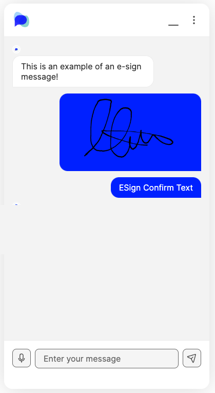

# E-Sign Message

## What is an e-sign message?

An e-sign message can be used within your OpenDialog chatbot to collect and gather signatures from your users. Users can input their signature and then send it over, to be stored by you and used in the future.

<div>

<figure><figcaption><p>Here is where the user can input their signature</p></figcaption></figure>

 

<figure><figcaption><p>An example of a user signature that's been inputted</p></figcaption></figure>

 

<figure><figcaption><p>An example of a signature that has been submitted</p></figcaption></figure>

</div>

## When to use e-sign messages

E-sign messages are best used when collecting data from the users. For example, if a user is signing up to a new insaurance policy, and the contract requires a signature to be completed.

## How to create an e-sign message

### Via the custom message in Message Editor

Navigate to the [Message Editor](../message-editor.md) and create a _Custom Message._ Copy the [XML snippet](e-sign-message.md#xml-snippet) at the bottom of this page into the black box, or select `esign-message` from the drop down, and your chat message will appear in the Preview panel.&#x20;

Fill in the template with the [properties](e-sign-message.md#properties) of your particular message and when you are happy with it make sure to save your message and test it in the Test Preview chat window.&#x20;

<figure><figcaption><p>How to create an e-sign message in the custom message block</p></figcaption></figure>


* Open your OpenDialog application
* Select the Scenario that you wish to edit
* Select Design from the left hand panel and select Messages
* Go into the message that you want to add a message block to
* Add a 'Custom Message' block
* Select 'e-sign' from the drop down
* Add in your own text to the fields you want to customise
* To preview your message, go to the Preview section


#### XML Snippet

```xml
<esign-message>
  <text>ESign Text</text>
  <callback>Continue</callback>
  <attribute_name>esign_attribute_name</attribute_name>
  <signature>true</signature>
  <submit_text>ESign Submit Text</submit_text>
  <resign_text>ESign Resign Text</resign_text>
  <confirm_text>ESign Confirm Text</confirm_text>
  <checkbox_text>ESign Checkbox Text</checkbox_text>
  <cancel_text>ESign Cancel Text</cancel_text>
  <cancel_callback>esign_cancel_callback</cancel_callback>
  <document_text>Document Text</document_text>
  <document_title>Document Title</document_title>
  <file_name>signature.pdf</file_name>
  <file_path>/signatures/test</file_path>
</esign-message>
```

## How to use e-sign messages


**Saving a message:** Always remember to hit 'Save Message' before closing or navigating away from the edit screen.


## How to construct an e-sign message

When structuring a message, you are able to use multiple different message blocks together to create the message that you are looking for. However, when it comes to ordering and structing these, there are some rules that need to be followed. To learn more about this, please head to the [Constructing Messages ](../constructing-messages.md)page for more information.


For all message types, a key element to take into consideration is **Accessibility**, especially for messages that include customisation with multimedia types such as buttons, images and links. For all information on accessibility within OpenDialog, please click [here](../../designing-accessible-chatbots.md).

