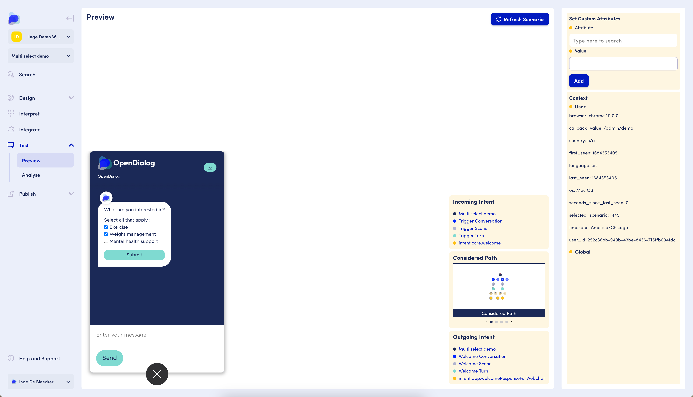
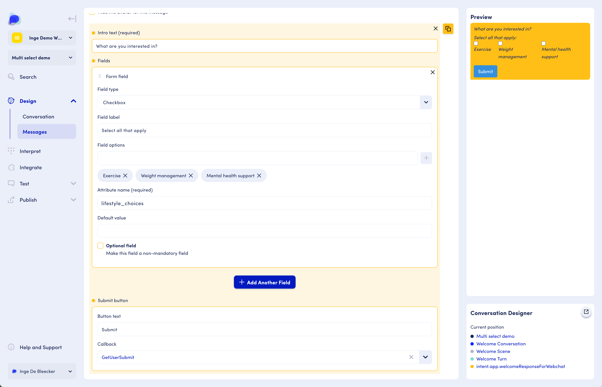

# Form Message

The form message lets you create more complicated message inputs that are great for capturing structured information about the user use as addresses or full names.

You can only add one form message type to each message, and it should be the last message in the list to work properly.&#x20;

### Properties

Each form message has the follow properties:

* **Text**: Form text can optionally be set and will be displayed at the top of the form message if set
* **Button text**: The text to display on the submit button shown at the bottom of the form message.
* **Callback**: Similarly to the 'simulate user intent' button messages, this field needs to be set to point to the next intent in the conversation flow. When clicked on, a list of all conversations for the current scenario is show listing each intent that is part of them. Either select the correct user intent, or create a new one using the drop down interface. See [button message](https://docs.opendialog.ai/messages/message-type-button-block#button-functionality) for more info

Each form message can have as many fields as needed to capture the information required. There are 4 main types of form fields:

### Another example: multi-select checkbox form message

Here is an example of a checkbox form message. This message type allows for multi-select. The selected options (whether 1 or more) are captured as the value for the attribute that is listed in the "Attribute name (required)" field. This attribute can be defined "on the fly" just by entering it here, or could be predefined as a [dynamic attribute](../../../designing-conversations/contexts-and-attributes/about-attributes.md).&#x20;

<figure><figcaption><p>Preview of a multi-select checkbox form message</p></figcaption></figure>

<figure><figcaption><p>Message editor page for the multi-select checkbox form message</p></figcaption></figure>

In this example, we gather the user's interests and provide simple recommendations based on the selected interests. For instance, if they selected weight management, the next message will provide information relevant to weight management.&#x20;

To do so, the attribute is used as a condition on the message in a next turn:

<figure><figcaption><p>The attribute being used as a condition on the message in a next turn</p></figcaption></figure>


For all message types, a key element to take into consideration is **Accessibility**, especially for messages that include customisation with multimedia types such as buttons, images and links. For all information on accessibility within OpenDialog, please click [here](../../designing-accessible-chatbots.md).


#### XML Snippet

Form messages allow for user to input data in standard web form rather than text entry. When submitted, the values entered by the user are sent back along with the defined `callback`. All form messages must contain the following elements:

```
    <form-message>
       <text>Text</text>
       <submit_text>Submit Text</submit_text>
       <callback>Callback</callback>
       <auto_submit>true|false</auto_submit>
    </form-message>
```

Here, the `text` value is shown at the top of the form message and the `submit_text` value is shown on the form submit button. When `auto_submit` is set to true, the form will automatically be submitted when the user selects a value. This works best when just 1 element is added to the form

**Elements**

Form messages have support for a number of different elements (matching what is possible in a standard HTML form). All elements are defined in the same way, and there is no limit to how many can appear on a form message.

Each element must define a `type` and `display`, and can optionally define `required` and `default_value`. If required is set to true, the form cannot be submitted unless the field has a value.

```
<element>
    <element_type>textarea|text|number|email|select|auto_complete_select|checkbox</element_type>
    <display>Display Name</display>
    <required>true|false</required>
    <default_value>Default Value</default_value>
</element>
```

When using `checkbox` or `select` elements, you must define an `options` block giving the options to be presented in the checkbox list or select element:

```
<element>
    <options>
      <option>
        <key>Key</key>
        <value>Value</value>
      </option>
    </options>
</element>
```

The `email` element type acts just like a `text` element, but on submission, is validated to ensure it is formatted like an email address

.png>)

This form message example was created with the following XML:

```
<message>
    <form-message>
        <text>Text</text>
        <submit_text>Submit Text</submit_text>
        <callback>Callback</callback>
        <auto_submit>false</auto_submit>

        <element>
            <element_type>select</element_type>
            <name>title</name>
            <display>Title</display>
            <options>
                <option>
                    <key>mr</key>
                    <value>Mr.</value>
                </option>
                <option>
                    <key>mrs</key>
                    <value>Mrs.</value>
                </option>
                <option>
                    <key>other</key>
                    <value>Other</value>
                </option>
            </options>
        </element>

        <element>
            <element_type>text</element_type>
            <name>name</name>
            <display>Name</display>
        </element>

    </form-message>
</message>
```


**Saves Message:** Always remember to hit 'Save Message' before closing or navigating away from the edit screen

